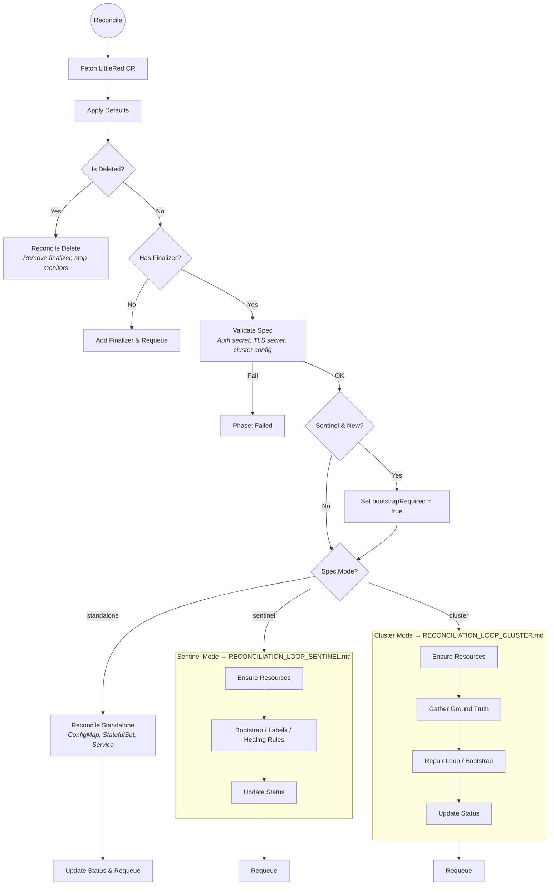

# Reconciliation Loop

This diagram describes the high-level reconciliation flow of the LittleRed operator. Mode-specific details are in dedicated documents:

- **[Sentinel Mode](RECONCILIATION_LOOP_SENTINEL.md)** — ground truth gathering, healing rules, kill-9 protection, DetermineRealMaster algorithm
- **[Cluster Mode](RECONCILIATION_LOOP_CLUSTER.md)** — ground truth gathering, repair loop (quorum recovery, partitions, ghosts, slots, replication), kill-9 protection

