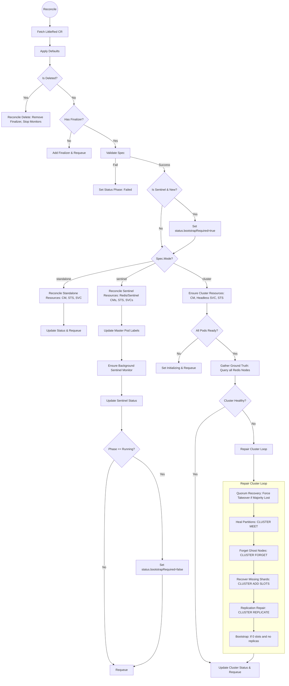

# Reconciliation Loop

This diagram describes the reconciliation logic of the LittleRed operator, including the high-level flow and mode-specific behaviors for Standalone, Sentinel, and Cluster modes.

