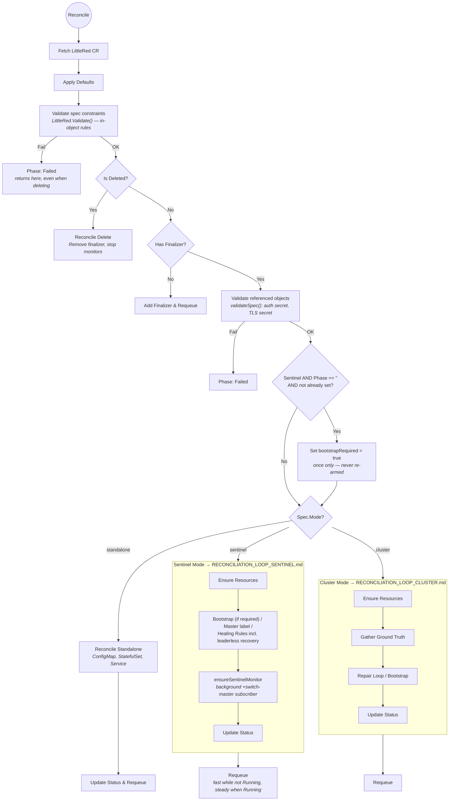

# Reconciliation Loop

This diagram describes the high-level reconciliation flow of the LittleRed operator. Mode-specific details are in dedicated documents:

- **[Sentinel Mode](RECONCILIATION_LOOP_SENTINEL.md)** — ground truth gathering, healing rules, kill-9 protection, DetermineRealMaster algorithm
- **[Cluster Mode](RECONCILIATION_LOOP_CLUSTER.md)** — ground truth gathering, repair loop (quorum recovery, partitions, ghosts, slots, replication), kill-9 protection

`bootstrapRequired` is set **once**, when a sentinel-mode instance is first seen at `Phase == ""`,
and is never re-armed. That is deliberate — it is what stops the operator re-seeding a master over
live data — but it also means a mass pod restart of an already-initialized instance has no path back
through bootstrap. Recovering from that state is Rule L's job, not this flow's (LR-015; see the
sentinel document).

> **Note on ordering.** There are **two** validation steps and they sit on opposite sides of the
> deletion check. `LittleRed.Validate()` runs first, before the operator looks at
> `DeletionTimestamp` — so a CR it rejects returns early and never reaches the delete path. Today
> that function only rejects `shards < 3` in cluster mode, which the CRD already prevents at
> admission, so it is unreachable for a normally-created object and cannot affect sentinel mode at
> all. It would bite an object created under an older CRD: such a CR would be undeletable, because
> its finalizer is never removed. `validateSpec()` (referenced Secrets) runs later, after the
> finalizer, where a failure cannot block deletion.

```mermaid
graph TD
    Start((Reconcile)) --> FetchCR[Fetch LittleRed CR]
    FetchCR --> ApplyDefaults[Apply Defaults]
    ApplyDefaults --> ValidateEarly["Validate spec constraints<br/><i>LittleRed.Validate() — in-object rules</i>"]

    ValidateEarly -- Fail --> SetFailedEarly["Phase: Failed<br/><i>returns here, even when deleting</i>"]
    ValidateEarly -- OK --> IsDeleted{Is Deleted?}

    IsDeleted -- Yes --> Cleanup["Reconcile Delete<br/><i>Remove finalizer, stop monitors</i>"]
    IsDeleted -- No --> HasFinalizer{Has Finalizer?}

    HasFinalizer -- No --> AddFinalizer[Add Finalizer & Requeue]
    HasFinalizer -- Yes --> Validate["Validate referenced objects<br/><i>validateSpec(): auth secret, TLS secret</i>"]

    Validate -- Fail --> SetFailed[Phase: Failed]
    Validate -- OK --> InitBootstrap{"Sentinel AND Phase == ''<br/>AND not already set?"}

    InitBootstrap -- Yes --> SetBootstrap["Set bootstrapRequired = true<br/><i>once only — never re-armed</i>"]
    InitBootstrap -- No --> ModeSwitch
    SetBootstrap --> ModeSwitch{Spec.Mode?}

    %% Standalone
    ModeSwitch -- standalone --> StandaloneFlow["Reconcile Standalone<br/><i>ConfigMap, StatefulSet, Service</i>"]
    StandaloneFlow --> StandaloneStatus["Update Status & Requeue"]

    %% Sentinel
    ModeSwitch -- sentinel --> SentinelBox

    subgraph SentinelBox ["Sentinel Mode  → RECONCILIATION_LOOP_SENTINEL.md"]
        direction TB
        SentinelRes["Ensure Resources"]
        SentinelRes --> SentinelBoot["Bootstrap (if required) / Master label /<br/>Healing Rules incl. leaderless recovery"]
        SentinelBoot --> SentinelMon["ensureSentinelMonitor<br/><i>background +switch-master subscriber</i>"]
        SentinelMon --> SentinelStatus["Update Status"]
    end

    SentinelBox --> SentinelRequeue["Requeue<br/><i>fast while not Running, steady when Running</i>"]

    %% Cluster
    ModeSwitch -- cluster --> ClusterBox

    subgraph ClusterBox ["Cluster Mode  → RECONCILIATION_LOOP_CLUSTER.md"]
        direction TB
        ClusterRes["Ensure Resources"]
        ClusterRes --> ClusterGT["Gather Ground Truth"]
        ClusterGT --> ClusterRepair["Repair Loop / Bootstrap"]
        ClusterRepair --> ClusterStatus["Update Status"]
    end

    ClusterBox --> ClusterRequeue["Requeue"]
```
