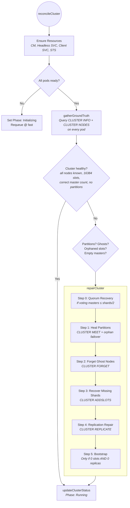
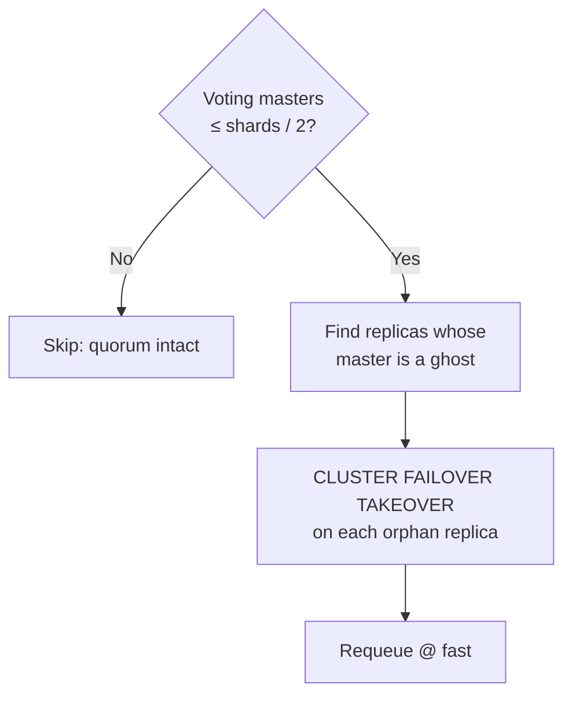
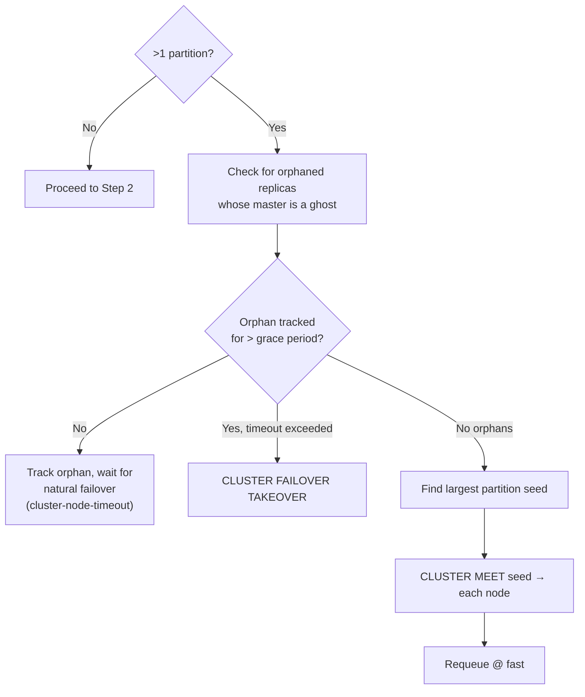
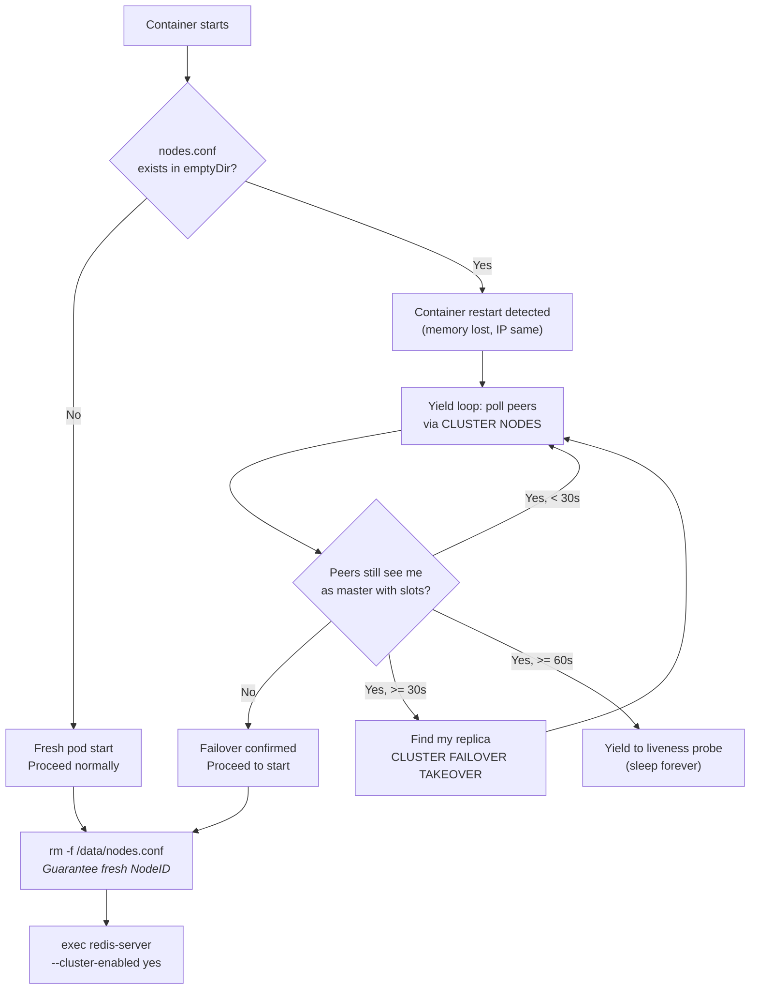

# Cluster Mode Reconciliation Loop

This document describes the detailed reconciliation logic for **Cluster mode** in the LittleRed operator.

For the high-level view that includes standalone and sentinel modes, see [RECONCILIATION_LOOP.md](RECONCILIATION_LOOP.md).

---

## Overview

Cluster mode manages:
- **Redis pods** (StatefulSet `<name>-cluster`): `shards * (1 + replicasPerShard)` nodes total
- **Slot ownership**: 16384 slots divided evenly across shards. Pod N owns shard N (strict positional mapping).
- **Replication**: each shard master has `replicasPerShard` replicas (default 1)

Unlike Sentinel mode, there is no external arbiter. Redis Cluster's built-in gossip protocol handles failure detection and failover via `cluster-node-timeout`. The operator's role is to:
1. Bootstrap new clusters
2. Heal topology after pod replacements (ghost nodes, partition merges, slot recovery)
3. Force-promote replicas when quorum is lost or natural failover is stuck

---

## Main Flow



---

## Ground Truth Gathering

`gatherGroundTruth` queries every pod and builds a `ClusterGroundTruth`:

| Source | Data Collected |
|--------|---------------|
| `CLUSTER MYID` on each pod | NodeID per pod |
| `CLUSTER INFO` on each pod | ClusterState (ok/fail), SlotsAssigned |
| `CLUSTER NODES` on each pod | Full topology: roles, slots, master-replica relationships, link state |
| K8s pod list | Which NodeIDs have living pods (vs ghosts) |

### Partition Detection

The operator builds an adjacency graph from each node's `CLUSTER NODES` output and runs BFS to find connected components. More than one component = partition.

### Ghost Detection

Any NodeID that appears in `CLUSTER NODES` output but does NOT have a corresponding living K8s pod is a ghost.

**Why K8s is the source of truth, not gossip**: Redis gossip-based failure detection (`FAIL` flag) can lag behind pod deletions by up to `cluster-node-timeout` (default 15s). During this window a "healthy ghost" problem occurs:

1. Pod is deleted — K8s knows immediately
2. Redis gossip still considers the NodeID healthy (no `FAIL` flag yet)
3. The ghost still "owns" its slots at a high `configEpoch`
4. `CLUSTER ADDSLOTS` for those ranges fails with "Slot already busy"
5. If a new pod is MEETed in before the ghost is forgotten, Redis's internal epoch conflict resolution can **demote the new pod to a replica of the ghost**

By using the K8s pod list, the operator detects and FORGETs ghosts immediately — before gossip catches up and before the new pod joins.

---

## Repair Steps Detail

### Step 0: Quorum Recovery



**Trigger**: The number of masters with slots drops to half or fewer of the expected shard count.

**Action**: For each replica whose master NodeID is not in the live node set, issue `CLUSTER FAILOVER TAKEOVER`.

**Why TAKEOVER?**: Normal `CLUSTER FAILOVER` requires the master to be reachable for a coordinated handoff. When the master is dead, only TAKEOVER works — it unilaterally claims the master's epoch and slots.

### Step 1: Heal Partitions



**Grace period**: `cluster-node-timeout + failoverGracePeriod` (default 15s). This allows Redis's natural failover to complete before the operator intervenes.

**Orphan tracking**: Orphaned replicas are tracked in `status.cluster.orphanedReplicas` with timestamps. The operator only force-promotes after the timeout, preventing premature interference.

**CLUSTER MEET**: Uses the largest partition as the seed. Every node outside the seed's partition is MEETed into it.

**Why CLUSTER MEET must wait for failover**: When a master dies, its replacement pod starts isolated — a partition. The naive fix is `CLUSTER MEET`, but issuing it during an in-progress failover is dangerous:
- Redis automatic failover requires a **majority vote from masters**
- A freshly-joined pod doesn't yet know the existing master-replica relationships and cannot vote correctly
- Disrupting the quorum can prevent the replica from being promoted, leaving the cluster stuck

The operator therefore blocks CLUSTER MEET while `HasOrphanedReplicas()` is true. This also implicitly delays ghost removal (Step 2): the orphaned replica needs the ghost's NodeID in the topology to identify which slots to claim during promotion.

### Step 2: Forget Ghost Nodes

**Trigger**: NodeIDs in `CLUSTER NODES` that don't have living K8s pods.

**Safety**: Ghost nodes that are still the master of a live replica are **protected** — they are NOT forgotten. The replica must be promoted first (Step 0/1), otherwise forgetting the ghost would leave the replica permanently stuck.

**Action**: `CLUSTER FORGET <ghostID>` issued from every living node (each node maintains its own known-nodes table).

### Step 3: Recover Missing Shards

**Validation**: The operator enforces strict positional shard mapping — Pod N owns shard N with a fixed slot range. If a slot range doesn't match any expected shard boundary, the operator refuses to reconcile (to avoid data loss from fragmented slots or external manipulation).

**Action**: For each missing shard, find Pod N (the intended master). If Pod N is alive and a master, issue `CLUSTER ADDSLOTS` for the expected range.

**Safety**: If the intended master pod isn't available, the operator waits rather than assigning to a different pod (which would cause split-ownership and "Slot already busy" errors).

### Step 4: Replication Repair

**Trigger**: Master nodes with 0 slots and no replicas (empty masters) in a cluster that has `replicasPerShard > 0`.

**Action**: Find a shard master that has fewer replicas than expected, and issue `CLUSTER REPLICATE <masterNodeID>` from the empty master.

### Step 5: Bootstrap

**Trigger**: `TotalSlots == 0` AND no replicas exist.

**Safety guard**: If there ARE replicas but 0 slots, it implies a previous state existed. The operator refuses to bootstrap to avoid overwriting an in-progress recovery.

**Action**: Full bootstrap sequence:
1. `CLUSTER MEET` all nodes via Pod 0
2. `CLUSTER ADDSLOTS` for each shard
3. `CLUSTER REPLICATE` for each replica

---

## Failure Scenarios

These walkthroughs show the repair sequence across multiple reconcile cycles for common failure patterns.

### Scenario 1: Single Master Failure (with replica)

**Situation**: One master dies. K8s replaces the pod. The cluster still has a majority of masters alive.

**What develops**: The old master's NodeID becomes a ghost; its replica becomes orphaned (still references the ghost as master); the new pod starts with a fresh NodeID, isolated from the cluster.

```
Reconcile #1:
  HasPartitions() = true (new pod isolated)
  HasOrphanedReplicas() = true (replica points to ghost master)
  → WAIT — CLUSTER MEET now would disrupt the in-progress failover vote

[Redis gossip promotes the orphaned replica to master automatically]

Reconcile #2:
  HasPartitions() = true
  HasOrphanedReplicas() = false (replica is now master)
  → CLUSTER MEET (heal partition, bring new pod in)

Reconcile #3:
  HasGhostNodes() = true
  → CLUSTER FORGET (remove ghost from every node's known-nodes table)

Reconcile #4:
  HasEmptyMasters() = true (new pod is a master with no slots)
  → CLUSTER REPLICATE (assign new pod as replica of the promoted shard)

Reconcile #5:
  Cluster healthy → Phase: Running
```

### Scenario 2: Quorum Loss (replicas survive)

**Situation**: Majority of masters die simultaneously (e.g., 2 out of 3 in a 3-shard cluster). Only 1 voting master remains — not enough for the gossip majority vote required for automatic failover.

**What develops**: Multiple ghost masters appear; multiple replicas are orphaned; `votingMasters (1) ≤ shards/2 (1)` triggers Step 0.

```
Reconcile #1:
  votingMasters (1) ≤ shards/2 (1) → Quorum loss detected
  For each orphaned replica:
    → CLUSTER FAILOVER TAKEOVER (force-promote without requiring a vote)

Reconcile #2:
  Quorum restored (promoted replicas are now voting masters)
  Normal repair continues (MEET, FORGET, REPLICATE)
```

`CLUSTER FAILOVER TAKEOVER` bypasses the voting mechanism entirely — the replica unilaterally claims its master's epoch and slots. This is safe because the operator has confirmed no K8s pod exists for the old master.

### Scenario 3: Shard Loss (no replica)

**Situation**: A master dies and all of its replicas also die. The shard's slots have no surviving node to take over.

**Behavior**: The operator detects orphaned slots (`TotalSlots < 16384`) but cannot recover the data. Human intervention or restoration from backup is required.

### Scenario 4: Master Failure in 0-Replica Mode

**Situation**: A master dies in a cluster with `replicasPerShard: 0`. There is no replica to promote — the shard's data is lost and its slots must be reassigned to the replacement pod.

**What develops**: The old master's NodeID becomes a ghost that still owns the slots (at a high `configEpoch`). The new pod starts with a fresh NodeID, isolated.

**Why ordering matters**: There is no failover to wait for, so the operator does not hold back CLUSTER FORGET. However, the ghost **must** be forgotten before MEET or ADDSLOTS:
- If not forgotten first, `CLUSTER ADDSLOTS` fails with "Slot already busy" (ghost's `configEpoch` wins the conflict)
- If the new pod is MEETed before FORGET, Redis epoch resolution can demote it to a replica of the ghost

```
Reconcile #1:
  HasGhostNodes() = true, HasOrphanedReplicas() = false (0-replica mode)
  → CLUSTER FORGET (remove ghost from all live nodes first)

Reconcile #2:
  HasPartitions() = true, no orphaned replicas to wait for
  → CLUSTER MEET (bring new pod into the cluster)

Reconcile #3:
  Missing shard detected; intended master (pod N) is alive and ready
  → CLUSTER ADDSLOTS (assign shard N's slot range to pod N)

Reconcile #4:
  Cluster healthy → Phase: Running
```

Pod N always receives shard N's slots (strict positional mapping). The operator never assigns a shard to a different pod as a fallback — if pod N is not yet ready, it waits.

---

## Pod-Level Safety: Kill-9 / Crash Protection

The cluster startup script implements crash detection independently of the operator:



**Why delete nodes.conf?** The emptyDir survives container restarts (it's pod-scoped, not container-scoped). A surviving `nodes.conf` means the restarted Redis process would announce its old NodeID, old slot assignments, and the old master status — with no data. Deleting it forces a fresh identity, which the operator's reconciliation loop then detects and heals (ghost removal + slot recovery + replication repair).

**Deadlock breaker**: If after 30 seconds (6 attempts) peers still see this pod as master with slots, natural failover hasn't happened (likely because `cluster-node-timeout` hasn't fired yet or the replica didn't promote). The script actively finds its own replica and issues `CLUSTER FAILOVER TAKEOVER` to unstick the cluster.

**Fatal timeout**: After 60 seconds, if the pod still owns slots, it enters an infinite sleep. The liveness probe will eventually kill the pod, and K8s will reschedule — breaking the cycle.

---

## Pre-Stop Hook

The cluster pre-stop hook handles graceful shutdown:

1. Queries `CLUSTER NODES` to determine this pod's role and slot ownership
2. If this pod is a master with slots:
   - Finds its replica
   - Issues `CLUSTER FAILOVER` (cooperative) to the replica
   - Waits for the replica to become master
3. If replica or no slots: exits immediately

---

## Status Determination

The operator reports `Phase: Running` when:
- All pods ready (StatefulSet `ReadyReplicas == Replicas`)
- `ClusterState == "ok"` (at least one node reports it)
- `TotalSlots == 16384`
- Master count == expected shard count
- No partitions
- No ghost nodes

---

## Debug

| Annotation | Effect |
|------------|--------|
| `chuck-chuck-chuck.net/debug-skip-slot-assignment` | Skip CLUSTER ADDSLOTS during bootstrap (for testing) |

---

## References
- [ADR-001: Strict IP-Only Identity (Cluster Amendment)](adr/001-strict-ip-identity.md#cluster-mode-has-an-active-fix-nodesconf-deletion)
- [Reconciliation Algorithm Changelog](RECONCILIATION_ALGORITHM_CHANGELOG.md)
- [RECONCILIATION_LOOP.md](RECONCILIATION_LOOP.md) — high-level view
