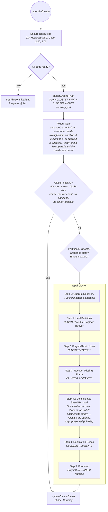
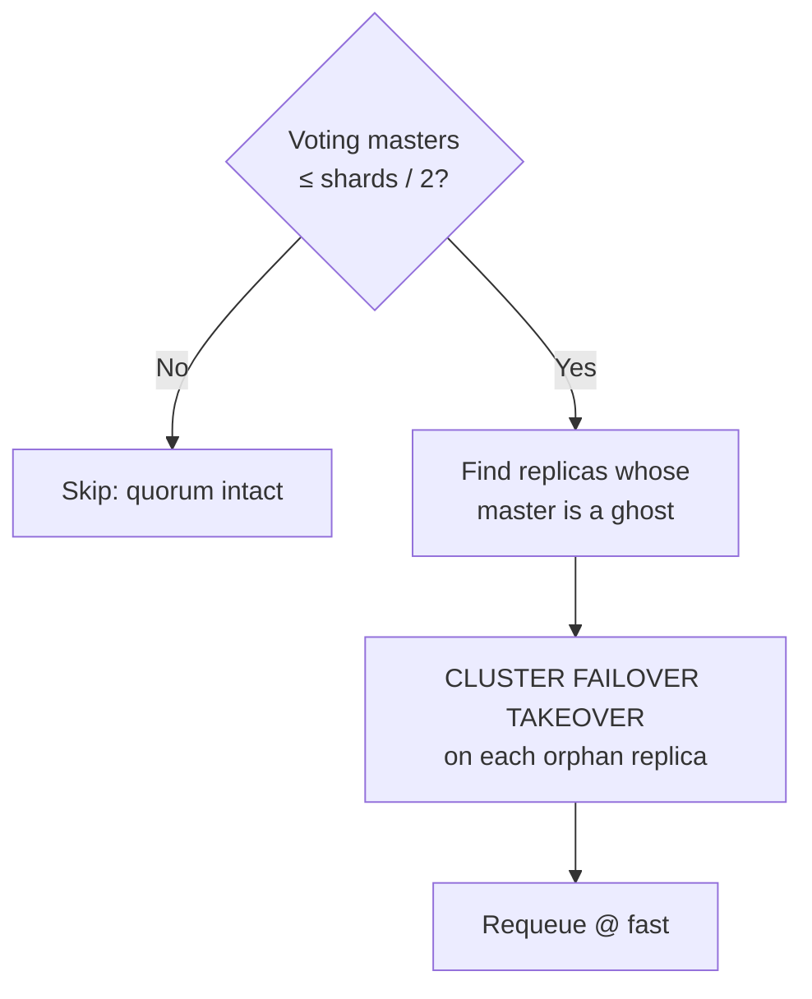
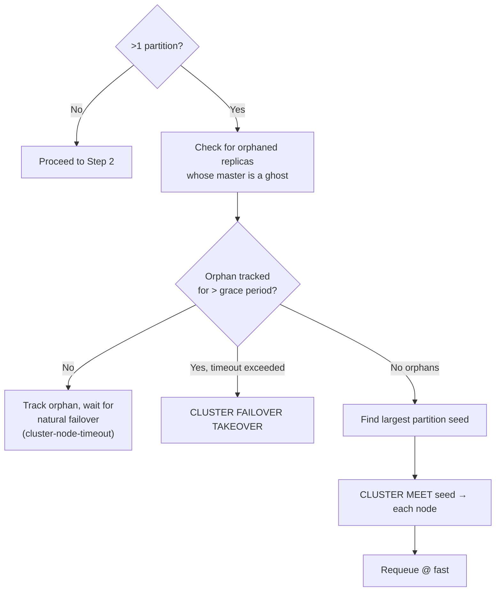
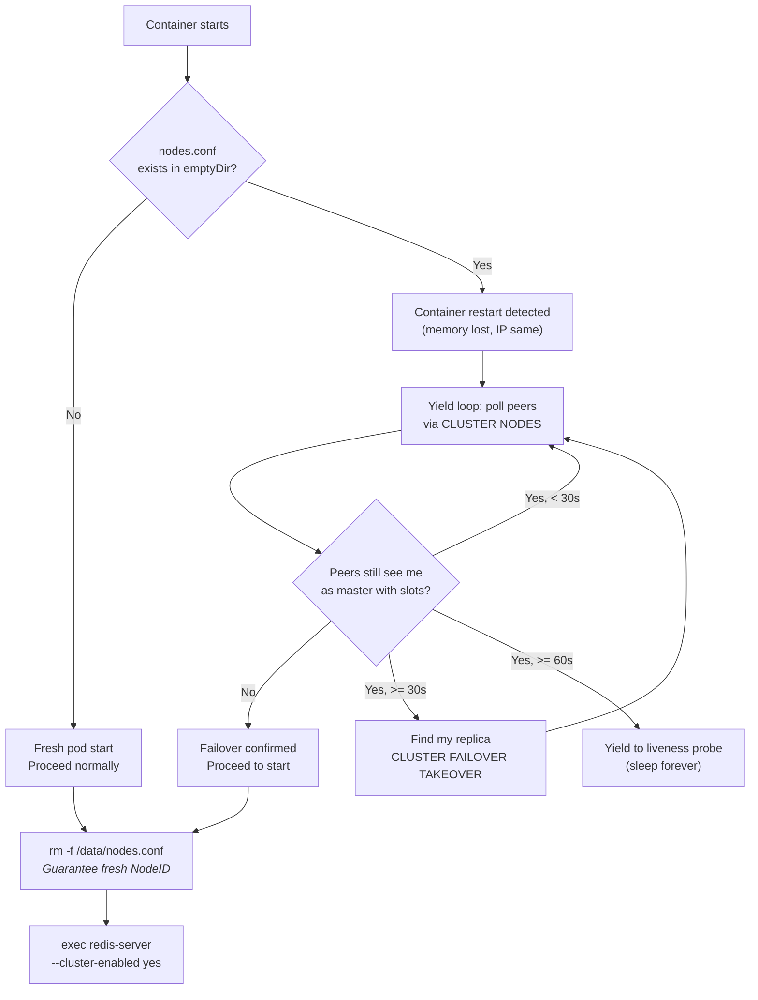

# Cluster Mode Reconciliation Loop

This document describes the detailed reconciliation logic for **Cluster mode** in the LittleRed operator.

For the high-level view that includes standalone and sentinel modes, see [RECONCILIATION_LOOP.md](RECONCILIATION_LOOP.md).

---

## Overview

Cluster mode manages:
- **Redis pods** (one StatefulSet per shard, `<name>-shard-K`, each `1 + replicasPerShard` pods): `shards * (1 + replicasPerShard)` nodes total. See ADR-007 / pillar 3.12. (Pre-0.3.0 this was a single `<name>-cluster` StatefulSet.)
- **Slot ownership**: 16384 slots divided evenly across shards. Shard K's intended master is pod `<name>-shard-K-0` (positional-within-shard); slot ownership itself is the runtime source of truth.
- **Replication**: each shard master (`<name>-shard-K-0`) has `replicasPerShard` replicas (`<name>-shard-K-1..R`, default 1)

Unlike Sentinel mode, there is no external arbiter. Redis Cluster's built-in gossip protocol handles failure detection and failover via `cluster-node-timeout`. The operator's role is to:
1. Bootstrap new clusters
2. Heal topology after pod replacements (ghost nodes, partition merges, slot recovery)
3. Force-promote replicas when quorum is lost or natural failover is stuck

---

## Main Flow


```mermaid
graph TD
    Start((reconcileCluster)) --> Resources["Ensure Resources<br/><i>CM, Headless SVC, Client SVC, STS</i>"]
    Resources --> STSReady{All pods ready?}

    STSReady -- No --> WaitPods["Set Phase: Initializing<br/>Requeue @ fast"]
    STSReady -- Yes --> GatherGT["gatherGroundTruth<br/><i>Query CLUSTER INFO + CLUSTER NODES<br/>on every pod</i>"]

    GatherGT --> RolloutGate["Rollout Gate<br/><i>advanceClusterRollout: lower one shard's<br/>rollingUpdate.partition iff every pod at or above it<br/>is updated, Ready and a link-up replica of the<br/>shard's slot owner</i>"]
    RolloutGate --> HealthCheck{"Cluster healthy?<br/><i>all nodes known, 16384 slots,<br/>correct master count, no partitions,<br/>no empty masters</i>"}

    HealthCheck -- Yes --> UpdateStatus["updateClusterStatus<br/><i>Phase: Running</i>"]
    HealthCheck -- No --> NeedsRepair{"Partitions? Ghosts?<br/>Orphaned slots?<br/>Empty masters?"}
    NeedsRepair --> RepairLoop

    subgraph RepairLoop ["repairCluster"]
        direction TB
        Step0["Step 0: Quorum Recovery<br/><i>If voting masters ≤ shards/2</i>"]
        Step0 --> Step1
        Step1["Step 1: Heal Partitions<br/><i>CLUSTER MEET + orphan failover</i>"]
        Step1 --> Step2
        Step2["Step 2: Forget Ghost Nodes<br/><i>CLUSTER FORGET</i>"]
        Step2 --> Step3
        Step3["Step 3: Recover Missing Shards<br/><i>CLUSTER ADDSLOTS</i>"]
        Step3 --> Step3b
        Step3b["Step 3b: Consolidated-Shard Reshard<br/><i>One master owns two shard ranges while<br/>another sits empty — relocate the surplus,<br/>keys preserved (LR-018)</i>"]
        Step3b --> Step4
        Step4["Step 4: Replication Repair<br/><i>CLUSTER REPLICATE</i>"]
        Step4 --> Step5
        Step5["Step 5: Bootstrap<br/><i>Only if 0 slots AND 0 replicas</i>"]
    end

    RepairLoop --> UpdateStatus
```

---

## Ground Truth Gathering

`gatherGroundTruth` queries every pod and builds a `ClusterGroundTruth`:

| Source | Data Collected |
|--------|---------------|
| `CLUSTER MYID` on each pod | NodeID per pod |
| `CLUSTER INFO` on each pod | ClusterState (ok/fail), SlotsAssigned |
| `CLUSTER NODES` on each pod | Full topology: roles, slots, master-replica relationships, link state |
| K8s pod list | Which NodeIDs have living pods (vs ghosts) |

Probes run **concurrently** with a hard per-pod deadline (`ClusterProbeTimeout`) so a stale/dead pod IP (handed over by the K8s cache during churn) cannot serialize-block the gather and starve the reconcile loop of iterations. See LR-012.

### Partition Detection

The operator builds an adjacency graph from each node's `CLUSTER NODES` output and runs BFS to find connected components. More than one component = partition.

### Ghost Detection

Any NodeID that appears in `CLUSTER NODES` output but does NOT have a corresponding living K8s pod is a ghost.

**Why K8s is the source of truth, not gossip**: Redis gossip-based failure detection (`FAIL` flag) can lag behind pod deletions by up to `cluster-node-timeout` (default 15s). During this window a "healthy ghost" problem occurs:

1. Pod is deleted — K8s knows immediately
2. Redis gossip still considers the NodeID healthy (no `FAIL` flag yet)
3. The ghost still "owns" its slots at a high `configEpoch`
4. `CLUSTER ADDSLOTS` for those ranges fails with "Slot already busy"
5. If a new pod is MEETed in before the ghost is forgotten, Redis's internal epoch conflict resolution can **demote the new pod to a replica of the ghost**

By using the K8s pod list, the operator detects and FORGETs ghosts immediately — before gossip catches up and before the new pod joins.

---

## State-Gated Rolling Updates

An operator-triggered pod-template change is gated twice: **across** shards (LR-021 — one shard
rolls at a time, `reconcileClusterStatefulSet` defers the rest until the current one settles) and,
since ADR-017 / LR-047, **within** a shard.

The intra-shard gate is `spec.updateStrategy.rollingUpdate.partition` on the shard StatefulSet.
Without it the intra-shard sequence belongs entirely to the StatefulSet controller, whose only
gates — readiness and `minReadySeconds` — are blind to redundancy: readiness is
`[ ! -f /data/bootstrap-in-progress ]` plus a local `PING`, which says nothing about cluster
membership, slot ownership or a replication link. A replaced pod returns on a wiped EmptyDir with a
**new node ID**, so it is a copy of nothing until the operator has `FORGET`/`MEET`/`REPLICATE`-d it
and it has full-synced. The invariant the gate enforces is LR-025's, applied to the rollout: *the
unsafe "owns slots, no synced replica" state never exists*.

**The decision** (pure `planShardRolloutPartition`, `internal/controller/cluster_rollout.go`), per
shard:

| Verdict | When | Partition emitted |
|---------|------|-------------------|
| `Ungated` | `replicasPerShard == 0` | none (no `rollingUpdate` block at all) |
| `Started` | first sight of a template-hash change | the shard's highest ordinal — **the only rise** |
| `Advanced` | every pod at or above the partition is (a) at `UpdateRevision`, (b) Ready per the kubelet, (c) a link-`up` replica of the shard's slot owner | current − 1 |
| `Holding` | any clause unsatisfied | current, unchanged |
| `Complete` | the shard has settled on the desired template | 0 |

`Complete` is evaluated **before** the clauses: a settled shard's own master owns the slots and is
therefore nobody's replica, so testing clause (c) against it would report a healthy shard as stuck.
The template-change check precedes `Complete` for the mirror reason — at first sight of a change the
shard is still settled on the *old* template.

**Two halves, one cursor.** Clause (c) is Redis-level state that only exists after the gather, but
the StatefulSet is written at step 1 by a server-side apply with `ForceOwnership`, so the partition
must be authoritative at build time or it flaps back to 0 every pass:

- **Pre-gather** (`reconcileClusterStatefulSet`) calls the seam with no pods and no ground truth, so
  it takes the structural branches only and can therefore only **hold or raise**.
- **Post-gather** (`advanceClusterRollout`, `reconcileCluster` step 4a) is the only place it comes
  **down**, one ordinal per pass, for the first shard in shard order that is not settled at the
  desired template. It runs *before* the repair branch, which returns and would otherwise skip the
  gate for the whole rollout.

The live StatefulSet's own `partition` field **is** the cursor — no status field, no annotation. It
is read **uncached** (`apiReader`) while a rollout is in flight, along with the shard's pods,
because a stale-low value would release the shard's master early; the steady loop keeps its cached
read. `shardSlotOwner` resolves the owner by slot **containment** of the shard's aligned range start
rather than exact range equality, so a fragmented or mid-reshard range (LR-018) does not resolve to
"no owner" — which would make clause (c) unsatisfiable forever. When no owner resolves at all,
nobody is synced and the gate holds: the safe direction.

**Why it cannot deadlock the cluster.** Holding leaves the *old* pods running and serving, so the
failure direction is a stalled upgrade, never an outage. The clause it waits on is discharged by the
operator's own repair loop (Step 4's shard-aware reattach), which runs on the fast requeue interval
for the whole rollout because a not-yet-reattached replacement is an empty master ⇒
`HasEmptyMasters()` ⇒ not healthy (LR-014). At partition 0 a hold is inert.

**Reporting is separate from acting.** `reportClusterRolloutGate` sets the
`ClusterRolloutBlocked` condition (`ShardNotRedundant`) and a once-per-transition Warning event when
a pod at `UpdateRevision` has been kubelet-Ready for longer than `clusterRolloutReattachBudget`
(120s) with **no attachment to the owner at all**. It is advisory — the emitted partition is
identical either way. An attached-but-link-down pod is a full sync in flight and is never reported
blocked however long it takes; a pod with no readiness timestamp is never reported blocked either,
because unknown is not evidence. There is deliberately **no timer that releases the hold**: manual
release is raising the partition by hand.

`replicasPerShard: 0` is ungated by construction, and the pass that triggers the roll emits a
`ClusterRolloutUngated` Warning stating that the shard's data will be lost.

**Residual:** the partition governs operator-triggered rollouts only. A manual
`kubectl rollout restart`, a node drain and an eviction bypass the operator entirely — LR-021's
documented limitation, inherited.

---

## Repair Steps Detail

### Step 0: Quorum Recovery


```mermaid
graph TD
    Check{"Voting masters<br/>≤ shards / 2?"}
    Check -- No --> Skip["Skip: quorum intact"]
    Check -- Yes --> FindOrphans["Find replicas whose<br/>master is a ghost"]
    FindOrphans --> Promote["CLUSTER FAILOVER TAKEOVER<br/>on each orphan replica"]
    Promote --> Requeue["Requeue @ fast"]
```

**Trigger**: The number of masters with slots drops to half or fewer of the expected shard count.

**Action**: For each replica whose master NodeID is not in the live node set, issue `CLUSTER FAILOVER TAKEOVER`.

**Why TAKEOVER?**: Normal `CLUSTER FAILOVER` requires the master to be reachable for a coordinated handoff. When the master is dead, only TAKEOVER works — it unilaterally claims the master's epoch and slots.

### Step 1: Heal Partitions


```mermaid
graph TD
    Partitions{">1 partition?"}
    Partitions -- No --> Next["Proceed to Step 2"]
    Partitions -- Yes --> OrphanCheck["Check for orphaned replicas<br/>whose master is a ghost"]

    OrphanCheck --> Tracked{"Orphan tracked<br/>for > grace period?"}
    Tracked -- No --> Wait["Track orphan, wait for<br/>natural failover<br/>(cluster-node-timeout)"]
    Tracked -- Yes, timeout exceeded --> ForceTakeover["CLUSTER FAILOVER TAKEOVER"]
    Tracked -- No orphans --> Meet

    Meet["Find largest partition seed"] --> MeetLoop["CLUSTER MEET seed → each node"]
    MeetLoop --> Requeue["Requeue @ fast"]
```

**Grace period**: `cluster-node-timeout + failoverGracePeriod` (default 15s). This allows Redis's natural failover to complete before the operator intervenes.

**Orphan tracking**: Orphaned replicas are tracked in `status.cluster.orphanedReplicas` with timestamps. The operator only force-promotes after the timeout, preventing premature interference.

**CLUSTER MEET**: Uses the largest partition as the seed. Every node outside the seed's partition is MEETed into it — but only at addresses the operator has **attributed to this instance in the current pass** (`PlanPartitionMeets` / `AttributeMeetTarget`, LR-043).

**Deciding guard — confirm the address, do not infer it**: before each MEET (targets *and* the seed), the operator re-reads the pod **uncached** from the API server (`APIReader`, same `get pods` permission) and requires it to still report that IP *and* to carry no `deletionTimestamp` (`confirmPodIP`). Kubernetes holds at most one live pod per IP, so a confirmed address is our pod by construction, and a recycled IP is by definition no longer our pod's. The terminating check closes the one window in which a pod object can name an address the CNI has already released and handed on — which is why this guard, not attribution, has the final word (see below). This runs on the MEET paths only — partition healing, bootstrap (where it simply replaces the existing cached read, at no extra cost) and the migration Meet phase — never in the steady loop or the gather. Residual, narrower still but not nil: a pod object whose IP is stale *without* a deletion timestamp, i.e. hard node loss where the kubelet is gone and `Status.PodIP` freezes.

**Why attribution is still there — as an advisory second layer**: `CLUSTER MEET` is the only Redis operation that creates a *fresh* identity binding. It performs no membership validation whatsoever (`clusterStartHandshake` checks the address syntax and nothing else), the receiver trusts an inbound MEET's whole gossip section, and the initiator adopts whatever node ID the responder reports — so a MEET at an address belonging to *another* instance merges the two clusters, bidirectionally and transitively via gossip. Node-ID keying protects only nodes we already know; the cluster bus carries no authentication, so `spec.auth` does not close it. Pod IPs here come from the cache-backed pod read (stale during churn — LR-012) and pod IPs really are recycled across unrelated instances on a shared pod network (LR-039). Attribution is the defence-in-depth half, covering the window above (and a mis-wired reader). **It informs but does not overrule the guard above**: on an address Kubernetes has positively confirmed, an `unattributed` verdict is logged as a disagreement and the MEET proceeds (`MeetVerdict.AdmissibleWhenConfirmed`; the candidates are listed on `MeetPlan.Unattributed`). Bus-state attribution is inference over a protocol carrying no instance identity, so it cannot be the deciding vote over a Kubernetes fact — and a veto there can *permanently* deny a legitimate own node, which is a stall with no way out, while the admit needs a rare coincidence. That was not hypothetical: it deadlocked the partial-wipe tier for eight minutes, because a surviving data-holder's view names only ghosts of peers that were recycled under new node IDs, so it has no known-ours anchor and cannot gain one without the very MEET being refused (changelog LR-043, regression section). A target is **attributed** when it is identified this pass *and* one of:

- **member** — its own gossip view names another node of ours (a genuinely partitioned node of this instance);
- **isolated** — its node table names nobody but itself, whatever slots it holds (a new/restarted/wiped pod, a survivor whose peers were FORGOTten, or an LR-018 consolidated master cut off from its peers).

Anything else that was *identified* is `unattributed` — reported, not refused. The verdicts that remain hard denials are the no-evidence ones (`no-address`, `unidentified`, `no-gossip-view`): no API-server read can supply evidence about an address nothing answered for, and unlike `unattributed` they are self-clearing, since partitions are computed only over operator-reachable nodes so such an address is in no detected partition anyway. Attribution therefore still *reports* the **established**-foreign-cluster case — the one that costs, since such a node arrives owning slots and carrying a config epoch — and still refuses it outright wherever the address is not confirmed. It deliberately concedes the isolated case: an isolated node **cannot** be attributed from bus state at all (the bus carries no instance identity), and our own pods are routinely isolated, so `confirmPodIP` is what protects that case. A slot-alignment clause was tried and removed — it bought ~no safety (`GenerateSlotRanges` is a pure function of `shards`, so same-N instances have identical ranges) while refusing a legitimate isolated master owning more than one range, i.e. the LR-018 state.

The seed is screened by the same rule and with the same authority order: the MEET is issued *at* the seed, so an unconfirmed seed would be told to meet all of our pods — the same merge, in the other direction. A seed that is merely `unattributed` but confirmed is used with a warning (with two single-node partitions the seed can *be* the post-wipe survivor, and refusing it refuses the whole pass); a seed that is unconfirmed or unidentified means no MEET that pass, and the loop retries at the fast cadence. An address that answers as a *pristine* Redis is indistinguishable from our own fresh pod (that is what our own pods look like at bootstrap), and merging one costs nothing — no data, no slots, no epoch; the established-foreign-cluster merge, which does cost, is closed.

**Why CLUSTER MEET must wait for failover**: When a master dies, its replacement pod starts isolated — a partition. The naive fix is `CLUSTER MEET`, but issuing it during an in-progress failover is dangerous:
- Redis automatic failover requires a **majority vote from masters**
- A freshly-joined pod doesn't yet know the existing master-replica relationships and cannot vote correctly
- Disrupting the quorum can prevent the replica from being promoted, leaving the cluster stuck

The operator therefore blocks CLUSTER MEET while `HasOrphanedReplicas()` is true. This also implicitly delays ghost removal (Step 2): the orphaned replica needs the ghost's NodeID in the topology to identify which slots to claim during promotion.

### Step 2: Forget Ghost Nodes

**Trigger**: NodeIDs in `CLUSTER NODES` that don't have living K8s pods.

**Safety**: Ghost nodes that are still the master of a live replica are **protected** — they are NOT forgotten. The replica must be promoted first (Step 0/1), otherwise forgetting the ghost would leave the replica permanently stuck.

**Action**: `CLUSTER FORGET <ghostID>` issued from every living node (each node maintains its own known-nodes table).

### Step 3: Recover Missing Shards

**Validation**: The operator enforces strict positional shard mapping — Pod N owns shard N with a fixed slot range. If a slot range doesn't match any expected shard boundary, the operator refuses to reconcile (to avoid data loss from fragmented slots or external manipulation).

**Action**: For each missing shard, find Pod N (the intended master). If Pod N is alive and a master, issue `CLUSTER ADDSLOTS` for the expected range.

**Safety**: If the intended master pod isn't available, the operator waits rather than assigning to a different pod (which would cause split-ownership and "Slot already busy" errors).

### Step 3b: Consolidated-Shard Reshard (LR-018, ADR-006)

**Trigger**: all slots are assigned, but a **single reachable master owns more than one** expected
shard range while another reachable master sits **empty** — so `CountMasters() < shards` and the
instance never reaches healthy. No other step could act: Step 3 checks only that each range has *an*
owner, never a *distinct* one, so it sees nothing missing; Step 4 only reattaches empty masters to
*under-replicated* slot-masters, and both slot-masters may already have their replica. A field
report sat in `Initializing` for ~19h in exactly this state.

**Decision** (pure `PlanReshard`): keep the lowest-index shard on the over-consolidated master and
relocate the surplus range onto the lowest-`PodName` reachable empty master — distinctness only.
Defers on a fragmented/non-aligned range, on no empty master, and on a healthy topology.

**Action** (`reshardConsolidated`), **keys preserved unconditionally** — a key-preserving reshard
always exists here, so there is deliberately **no drop-keys opt-in** (contrast sentinel mode's
`allowUnsafeRebootstrapOnDeadlock`). The mechanism is chosen by a **free gather-time capability
probe** — the `cluster_slot_migration_*` fields already present in `CLUSTER INFO`, AND-ed over all
reachable nodes so a mixed-version rolling upgrade falls back to the baseline; **nothing is
persisted**, because an internal engine capability is not a monitoring surface (ADR-006):

- **Redis 8.4+** — native atomic slot migration (`CLUSTER MIGRATION IMPORT`, re-entrant via
  `STATUS`).
- **pre-8.4** — the incremental `reshardViaDance`: mark IMPORTING/MIGRATING, drain bounded key
  batches per reconcile, and flip `SETSLOT NODE` **only once the whole range is drained**. Ownership
  flips at the end, so the plan re-emits the same move and the executor **resumes from the cluster's
  own on-node markers** — no persisted operator state. Tunables:
  `spec.cluster.reshard{KeyBatchSize,MaxKeysPerReconcile,MigrateTimeoutMillis}`.

**Ordering**: before Step 4, so the freshly-created third master exists for the remaining empty
master(s) to be reattached to as its replicas.

**The cause is closed in Step 3**, not only the symptom: `SafeMissingShardTarget` restricts
missing-shard assignment to a reachable **empty** master, so recovery can never pile a second range
onto a master that already owns one — the drift that created this state in the first place.

### Step 4: Replication Repair

**Trigger**: Master nodes with 0 slots (empty masters) in a cluster that has `replicasPerShard > 0`. An empty master is the cold-start state of any restarted pod (pure in-memory, no `cluster-config-file` to persist its old identity), so this is the normal path back from a pod replacement.

**Action**: Find a shard master that has fewer replicas than expected, and issue `CLUSTER REPLICATE <masterNodeID>` from the empty master.

**Health gating (LR-014)**: An empty master makes the cluster **not healthy** (`IsHealthy` returns false), so the operator stays on the fast requeue cadence until the reattach completes. Otherwise the cluster would be declared `Running` with one shard under-replicated, dropping to the 30s steady cadence and stalling the reattach. The `CLUSTER REPLICATE` can transiently fail with `ERR Unknown node` when gossip has not yet propagated the target master's NodeID to the freshly-MEETed empty master; the fast cadence retries within ~2s once gossip converges.

### Step 5: Bootstrap

**Trigger**: `TotalSlots == 0` AND no replicas exist.

**Safety guard**: If there ARE replicas but 0 slots, it implies a previous state existed. The operator refuses to bootstrap to avoid overwriting an in-progress recovery.

**Action**: Full bootstrap sequence:
1. `CLUSTER MEET` all nodes via Pod 0
2. `CLUSTER ADDSLOTS` for each shard
3. `CLUSTER REPLICATE` for each replica

---

## Failure Scenarios

These walkthroughs show the repair sequence across multiple reconcile cycles for common failure patterns.

### Scenario 1: Single Master Failure (with replica)

**Situation**: One master dies. K8s replaces the pod. The cluster still has a majority of masters alive.

**What develops**: The old master's NodeID becomes a ghost; its replica becomes orphaned (still references the ghost as master); the new pod starts with a fresh NodeID, isolated from the cluster.

```
Reconcile #1:
  HasPartitions() = true (new pod isolated)
  HasOrphanedReplicas() = true (replica points to ghost master)
  → WAIT — CLUSTER MEET now would disrupt the in-progress failover vote

[Redis gossip promotes the orphaned replica to master automatically]

Reconcile #2:
  HasPartitions() = true
  HasOrphanedReplicas() = false (replica is now master)
  → CLUSTER MEET (heal partition, bring new pod in)

Reconcile #3:
  HasGhostNodes() = true
  → CLUSTER FORGET (remove ghost from every node's known-nodes table)

Reconcile #4:
  HasEmptyMasters() = true (new pod is a master with no slots)
  → CLUSTER REPLICATE (assign new pod as replica of the promoted shard)

Reconcile #5:
  Cluster healthy → Phase: Running
```

### Scenario 2: Quorum Loss (replicas survive)

**Situation**: Majority of masters die simultaneously (e.g., 2 out of 3 in a 3-shard cluster). Only 1 voting master remains — not enough for the gossip majority vote required for automatic failover.

**What develops**: Multiple ghost masters appear; multiple replicas are orphaned; `votingMasters (1) ≤ shards/2 (1)` triggers Step 0.

```
Reconcile #1:
  votingMasters (1) ≤ shards/2 (1) → Quorum loss detected
  For each orphaned replica:
    → CLUSTER FAILOVER TAKEOVER (force-promote without requiring a vote)

Reconcile #2:
  Quorum restored (promoted replicas are now voting masters)
  Normal repair continues (MEET, FORGET, REPLICATE)
```

`CLUSTER FAILOVER TAKEOVER` bypasses the voting mechanism entirely — the replica unilaterally claims its master's epoch and slots. This is safe because the operator has confirmed no K8s pod exists for the old master.

### Scenario 3: Shard Loss (no replica)

**Situation**: A master dies and all of its replicas also die. The shard's slots have no surviving node to take over.

**Behavior**: The operator detects orphaned slots (`TotalSlots < 16384`) but cannot recover the data. Human intervention or restoration from backup is required.

### Scenario 4: Master Failure in 0-Replica Mode

**Situation**: A master dies in a cluster with `replicasPerShard: 0`. There is no replica to promote — the shard's data is lost and its slots must be reassigned to the replacement pod.

**What develops**: The old master's NodeID becomes a ghost that still owns the slots (at a high `configEpoch`). The new pod starts with a fresh NodeID, isolated.

**Why ordering matters**: There is no failover to wait for, so the operator does not hold back CLUSTER FORGET. However, the ghost **must** be forgotten before MEET or ADDSLOTS:
- If not forgotten first, `CLUSTER ADDSLOTS` fails with "Slot already busy" (ghost's `configEpoch` wins the conflict)
- If the new pod is MEETed before FORGET, Redis epoch resolution can demote it to a replica of the ghost

```
Reconcile #1:
  HasGhostNodes() = true, HasOrphanedReplicas() = false (0-replica mode)
  → CLUSTER FORGET (remove ghost from all live nodes first)

Reconcile #2:
  HasPartitions() = true, no orphaned replicas to wait for
  → CLUSTER MEET (bring new pod into the cluster)

Reconcile #3:
  Missing shard detected; intended master (pod N) is alive and ready
  → CLUSTER ADDSLOTS (assign shard N's slot range to pod N)

Reconcile #4:
  Cluster healthy → Phase: Running
```

Pod N always receives shard N's slots (strict positional mapping). The operator never assigns a shard to a different pod as a fallback — if pod N is not yet ready, it waits.

---

## Pod-Level Safety: Kill-9 / Crash Protection

The cluster startup script implements crash detection independently of the operator:


```mermaid
graph TD
    Start["Container starts"] --> NodesConf{"nodes.conf<br/>exists in emptyDir?"}

    NodesConf -- No --> FreshStart["Fresh pod start<br/>Proceed normally"]
    NodesConf -- Yes --> CrashDetected["Container restart detected<br/>(memory lost, IP same)"]

    CrashDetected --> YieldLoop["Yield loop: poll peers<br/>via CLUSTER NODES"]
    YieldLoop --> StillMaster{"Peers still see me<br/>as master with slots?"}

    StillMaster -- No --> Safe["Failover confirmed<br/>Proceed to start"]
    StillMaster -- Yes, < 30s --> YieldLoop
    StillMaster -- Yes, >= 30s --> ForceFailover["Find my replica<br/>CLUSTER FAILOVER TAKEOVER"]
    ForceFailover --> YieldLoop

    StillMaster -- Yes, >= 60s --> Fatal["Yield to liveness probe<br/>(sleep forever)"]

    Safe --> DeleteNodes["rm -f /data/nodes.conf<br/><i>Guarantee fresh NodeID</i>"]
    FreshStart --> DeleteNodes
    DeleteNodes --> ExecRedis["exec redis-server<br/>--cluster-enabled yes"]
```

**Why delete nodes.conf?** The emptyDir survives container restarts (it's pod-scoped, not container-scoped). A surviving `nodes.conf` means the restarted Redis process would announce its old NodeID, old slot assignments, and the old master status — with no data. Deleting it forces a fresh identity, which the operator's reconciliation loop then detects and heals (ghost removal + slot recovery + replication repair).

**Deadlock breaker**: If after 30 seconds (6 attempts) peers still see this pod as master with slots, natural failover hasn't happened (likely because `cluster-node-timeout` hasn't fired yet or the replica didn't promote). The script actively finds its own replica and issues `CLUSTER FAILOVER TAKEOVER` to unstick the cluster.

**Fatal timeout**: After 60 seconds, if the pod still owns slots, it enters an infinite sleep. The liveness probe will eventually kill the pod, and K8s will reschedule — breaking the cycle.

---

## Pre-Stop Hook

The cluster pre-stop hook handles graceful shutdown:

1. Queries `CLUSTER NODES` to determine this pod's role and slot ownership
2. If this pod is a master with slots:
   - Finds its replica
   - Issues `CLUSTER FAILOVER` (cooperative) to the replica
   - Waits for the replica to become master
3. If replica or no slots: exits immediately

---

## Status Determination

The operator reports `Phase: Running` when:
- All pods ready (summed `ReadyReplicas` across the per-shard StatefulSets == `shards * (1 + replicasPerShard)`)
- `ClusterState == "ok"` (at least one node reports it)
- `TotalSlots == 16384`
- Master count == expected shard count
- No partitions
- No ghost nodes

---

## Debug

| Annotation | Effect |
|------------|--------|
| `redis.chuck-chuck-chuck.net/debug-skip-slot-assignment` | Skip CLUSTER ADDSLOTS during bootstrap (for testing) |

---

## References
- [ADR-001: Strict IP-Only Identity (Cluster Amendment)](adr/001-strict-ip-identity.md#cluster-mode-has-an-active-fix-nodesconf-deletion)
- [ADR-006: Consolidated-Shard Reshard Recovery](adr/006-cluster-consolidated-shard-reshard.md) — Step 3b
- [ADR-017: State-Gated Intra-Shard Rolling Updates](adr/017-state-gated-cluster-rolling-updates.md)
- [Reconciliation Algorithm Changelog](RECONCILIATION_ALGORITHM_CHANGELOG.md)
- [RECONCILIATION_LOOP.md](RECONCILIATION_LOOP.md) — high-level view
