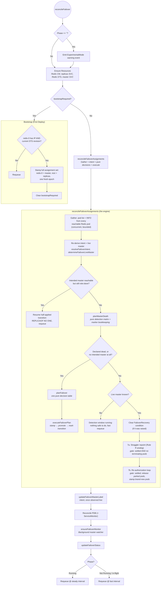

# Failover Mode Reconciliation Loop

This document describes the detailed reconciliation logic for **failover mode** (experimental, ADR-011) in the LittleRed operator.

For the high-level view that includes standalone, sentinel, and cluster modes, see [RECONCILIATION_LOOP.md](RECONCILIATION_LOOP.md). For the sentinel-mode loop this mode is the alternative to, see [RECONCILIATION_LOOP_SENTINEL.md](RECONCILIATION_LOOP_SENTINEL.md).

> **Status**: failover mode is **experimental**. The operator emits a warning event
> (`ExperimentalMode`) on the first reconcile of a failover-mode instance.
>
> **e2e coverage is complete and at parity with sentinel mode**, and is not what
> remains: the HA suite is green 16/16 on a real 3-node cluster, and durability was
> verified over 10 consecutive passes of the six-cell cross-mode chaos matrix (60
> runs, 2026-08-20) with **0 lost writes and 0 corruptions in every block**. In the
> kill-9 column the two modes' distributions do not overlap — failover 85.13–95.73%
> write availability against sentinel 43.32–73.89%.
>
> What is still pending on the ADR-011 graduation gate is **real-world evidence**:
> managed-cloud dogfooding, and then the drop/coexist/replace-sentinel decision.
> The mode has not carried production traffic.

---

## Overview

Failover mode manages two components:
- **Redis pods** (StatefulSet `<name>-redis`): one master + `spec.failover.replicas` replicas (default 2), parallel pod management
- **The operator**: the *sole* failure detector and failover decider — there are no Sentinel processes

The philosophy shift versus sentinel mode: instead of enabling and occasionally nudging a second authority (Sentinel), the operator **owns** bootstrap, failure detection, the failover decision, and repair. There is exactly one decider, so the operator-vs-Sentinel race class (LR-007/LR-008, LR-013, LR-024) does not exist here. The cost, accepted in ADR-011: HA is coupled to operator liveness.

All decisions live in pure, I/O-free functions (`planMasterDeath`, `planFailover`, and the intent helpers in `failover_intent.go`); `reconcileFailover` only gathers inputs and executes the returned plans.

---

## The Intent Model

The operator's assignment annotations on the data pods **are** the intent record. Nothing load-bearing is persisted in status (ADR-006 discipline); everything below is re-derived from the pod list and live gather on every pass.

| Annotation | Meaning |
|------------|---------|
| `redis.chuck-chuck-chuck.net/assigned-role` | `master` or `replica` |
| `redis.chuck-chuck-chuck.net/assigned-master-ip` | The master IP a replica must follow (empty on the master's own stamp) |
| `redis.chuck-chuck-chuck.net/assignment-epoch` | Monotonic per instance; a new master intent is always stamped at `maxEpoch + 1` |

Pods mount their own annotations through a **downward-API volume** (`/podinfo/annotations`); the startup script polls the projected file until an assignment is present and fresh, then `exec`s `redis-server` — bare for `master`, `--replicaof <ip> <port>` for `replica`. The kubelet rewrites the file whenever the annotations change, so pods observe (re-)assignments without any API-server access.

Derived values (pure functions, `failover_intent.go`):

- **`resolveFailoverIntent`** — the *intended master* is the pod with `assigned-role: master` at the **highest** epoch (ties break to the lexicographically smallest pod name); `maxEpoch` spans all assignments on all pods.
- **`determineFailoverLiveMaster`** — the *live master* is the intended master's IP **iff** that pod is reachable and reports `role:master`. An unintended reachable `role:master` (old master still up mid-transition, or a bare restarted pod) is a straggler for the repoint loop, never the live master — the operator's intent is the sole authority.
- **`failoverTransitionSettled`** — the latest intent has converged: the intended master reports `role:master` *and* carries the `role=master` K8s label.
- **`failoverPromotionUnsettled`** — deliberately **narrower** than `!settled`: an in-flight transition blocks a *new* mastership decision only while its target is still **alive and converging**. A dead/unreachable intended master never blocks its own replacement (see Guards below).

### The epoch gate (kill-9 yield)

Before `exec`, the startup script writes the consumed epoch to a run-marker on the EmptyDir (`/data/littlered-run-epoch`). The marker survives a container restart (same pod, same IP, wiped dataset) but not a pod replacement. An assignment is honored only if there is no marker **or** its epoch is strictly greater than the marker's. A kill-9'd ex-master therefore replays its stale `assigned-role: master` annotation and **parks in the wait-loop — parking is the yield**. The operator, seeing the restart with its global view, either fails over to a data-holding replica (epoch bumped; the parked pod is later re-stamped replica) or re-authorizes the pod as master when no data exists anywhere. This re-owns the ADR-001 same-IP hazard that sentinel mode handled with the run-id query, with the operator as the authority. There is deliberately no reachability PING before starting as a replica (ADR-002's deadlock constraint).

---

## Main Flow

The engine executes **one class of action per pass** (stamping one consistent assignment set — master + replicas at one epoch — counts as one action); conflicting actions prefer a fast requeue over a multi-step blast.

---

## Ground Truth Gathering

The operator queries **every** Redis pod on each reconcile (there are no Sentinels to query). It reuses the shared replication-state gather (`GatherReplicationState` with an empty sentinel map): concurrent probes, hard `ProbeTimeout` per pod (LR-012/LR-017 discipline — a blackholing dead IP costs ≤3s, never a stalled reconcile).

| Source | Data Collected |
|--------|---------------|
| Each Redis pod (full `INFO`) | Role, MasterHost, LinkStatus, Offset, Keys, Replid/Replid2, Reachable |
| K8s pod list | IP, deletionTimestamp, redis-container Ready + restartCount, assignment annotations, role labels |

The state's Sentinel-derived fields (e.g. the `RealMasterIP` fallback to any reachable `role:master`) are deliberately **ignored**: in failover mode the operator's intent is the sole master authority (`determineFailoverLiveMaster`).

---

## Engine Order in Detail

`reconcileFailoverAssignments` (skipped entirely while `bootstrapRequired`):

1. **Gather** the K8s pod view (terminating pods noted, not probed as identity) and the Redis ground truth.
2. **Re-derive** intent, live master, role-label map, settledness.
3. **Resume a half-applied promotion** (ADR-006: resumable from live state, no persisted cursor): if the intent names a master that is reachable but still runs as a replica — the stamp landed but `REPLICAOF NO ONE` did not (operator restart / transient error mid-execution) — re-issue the promotion and requeue. This runs *before* failure detection, so an interrupted transition completes before anything else is considered.
4. **Failure detection** for the intended master (pure `planMasterDeath`; marker bookkeeping on `status.failover.masterDownSince` — see the matrix below).
5. **The failover decision** (pure `planFailover`): runs when the master is declared dead **or** when there is no intended master at all (fresh pods, or the annotations died with their pods). Executed by `executeFailoverPlan`.
6. **Healthy-path healing** (requires a live master; while a detection window runs there is nothing safe to do):
   - Clear the `FailoverRecovery` condition (records `Recovered`) if it was raised.
   - **7a. Straggler repoint** (the Rule R analog, `planFailoverRepoints`): `SLAVEOF <liveMaster>` to any reachable pod that claims `role:master` unintendedly or follows a wrong master IP. A replica already following the live master with `link:down` is *not* repointed (transient handshake — LR-010 parity). Gate: settled transition **and** no terminating pods (ADR-011 §6 secondary healing keeps the conservative gate).
   - **7b. Re-authorization** (`planFailoverReauth`): a **brand-new** pod (no assignment annotations — scale-up or StatefulSet recreation) is stamped replica-of-the-live-master at the current `maxEpoch` (nothing consumed, honored immediately); a **parked** pod (has an assignment, redis restarted + not-Ready + unreachable — its epoch is consumed by the run-marker) is stamped at `maxEpoch + 1`, releasing it. The intended master is never stamped here (a blind master restamp is the ADR-001 hazard); pods without an IP, terminating pods, and the live master itself are skipped. Gate: settled transition (annotation stamps are inert metadata, so no terminating-pods gate). Data-safe: a not-Ready redis in a pure in-memory instance holds nothing (ADR-008).

### Execution order on promotion (`executeFailoverPlan`)

Stamp the new intent first (annotations at `maxEpoch + 1` — the durable record a crashed operator resumes from), then `REPLICAOF NO ONE` on the elect (`promoteFailoverMaster`, only when it is a reachable replica; an unreachable/parked elect starts fresh as master via its startup script), then mark the transition (`transitionSince` stamped, `assignmentEpoch` mirrored, `masterDownSince` cleared). The master **label** flips in a later pass, once the intended master is *observed* `role:master` — so traffic moves only to a verified master.

---

## The Master-Death Predicate (`planMasterDeath`)

Pure detection matrix, checked in order:

| # | Condition | Action |
|---|-----------|--------|
| 1 | Master pod gone/replaced (name+IP identity, ADR-001), redis container **not-Ready per kubelet**, or **terminating** | **DeclareK8s** — dead immediately, no window. The kubelet's local probe is blackhole-proof (ADR-008); a terminating master is the graceful-handover trigger (ADR-011 §7) |
| 2 | Operator can reach the master | **ClearMarker** — alive; `masterDownSince` reset |
| 3 | Unreachable, no marker | **StartWindow** — stamp `masterDownSince`, wait out `downAfterMilliseconds` |
| 4 | Unreachable, window not elapsed | **Wait** — blip filtering; even unanimous `link:down` does not shortcut the window |
| 5 | Window elapsed AND ≥1 reachable replica AND **all** of them report `link:down` | **DeclareProbe** — dead, corroborated |
| 6 | Window elapsed otherwise | **Hold** — vetoed (a replica sees `link:up` ⇒ operator-side network issue, LR-017) or uncorroborable (no reachable replica ⇒ the operator's own dial is never sufficient; kubelet readiness is the authoritative fallback for a truly dead pod) |

Hold-vs-clear on veto (deliberate): the marker is **held**, not cleared — it records operator-observed unreachability, which is factually still true. Clearing it would restart the window on every replica-link flap and could postpone a genuine declaration indefinitely. The link-up veto gates the *declaration*, never the timer: the moment every reachable replica loses its link, "≥ window unreachable + unanimous link:down" is exactly the corroborated signature.

---

## The Failover Decision (`planFailover`)

One pure table owns every "who should be master" decision — bootstrap seeding, normal failover, and the deadlock matrix that sentinel mode needed three separate rules for (bootstrap, Rule L, the LR-024 ghost-master rule). Decision order:

1. A live master exists → **none** (stragglers are execution, handled by 7a).
2. Unsettled prior transition (target alive and converging) → **wait**.
3. Within the 10s post-transition cooldown (`transitionSince`) → **wait** (serializes cascading flips).
4–6. Otherwise, the deadlock matrix, keyed on the gathered data holders:

| Reachable data holders | Lineage | Action | Event / condition |
|------------------------|---------|--------|-------------------|
| 0 | — | **Seed** the deterministic bootstrap candidate (`redis-0` preferred, `pickBootstrapMasterIP`; no candidate yet → wait) | `Reseeded` (Normal) |
| ≥1, all **one lineage** | `holdersDiverged == false` — union-find over `{master_replid, master_replid2}`, so a normal post-failover **promotion chain** is one lineage (LR-024 lesson) | **Promote** `BestDataHolder` (highest offset, tie-break keys then IP). **No opt-in** — same-lineage losers resync from the winner with no independent writes lost | `FailoverPromoted` (Normal) |
| ≥2 **independent lineages**, opt-in off | `holdersDiverged == true` | **Refuse** — electing any one discards independent writes. Wait for manual intervention | `RefusedDataPresent` (Warning) + condition `FailoverRecovery=True` |
| ≥2 independent lineages, `failover.allowUnsafeRebootstrapOnDeadlock` | | **Unsafe elect** the best holder; the other lineages full-resync from it and their data is discarded | `UnsafeRebootstrap` (Warning) |

Deliberate contrast with sentinel-mode Rule A: there is **no terminating-pods gate** in this table — a crash failover is exactly the moment the dead master pod is terminating, and its termination must never block promoting a survivor.

---

## Guards: Settled vs. Promotion-Unsettled

Two distinct gates, deliberately not the same predicate:

- **`failoverTransitionSettled`** (full settledness: intended master observed `role:master` + labeled) gates *secondary healing* — straggler repoint and re-authorization. Conservative: never repoint or restamp while a master flip is still converging.
- **`failoverPromotionUnsettled`** gates a *new mastership decision* — and is narrower: a transition blocks re-election only while its target is still **alive** (reachable) and converging. A dead/unreachable intended master never blocks its own replacement; its transition is moot and re-election is the remedy. Gating on bare unsettledness would deadlock exactly the crash and graceful-handover recoveries this mode exists for (a dead target can never again converge). Cascade serialization for that case is the time-based post-transition cooldown, not this gate.

Probes make no topology decisions (LR-016): the failover-mode liveness probe is a plain local health check (bootstrap guard + local `PING`) and the readiness probe requires `role:master` or `master_link_status:up` — both **delegate to the sentinel-mode builders** so the modes cannot drift. A masterless or mis-pointed replica is pulled from traffic without being killed.

---

## The Master Watcher (fast path)

A per-instance background goroutine (`failover_monitor.go`) — the failover-mode replacement for the sentinel `+switch-master` subscriber:

- Probes `status.master.ip` every ~1s with a `ProbeTimeout`-bounded `INFO` (not bare `PING`, so a wedged-but-accepting master counts as down).
- Re-resolves the probe target and `downAfterMilliseconds` from the informer-cached CR on **every tick** (it has no subscription to learn topology from); a master-IP change re-arms the failure streak, and during a transition `status.master.ip` is empty so the watcher idles — exactly the phase where reconcile is already fast-requeueing.
- When a failure streak crosses `downAfterMilliseconds`, it pushes **one** `GenericEvent` onto the shared reconcile-trigger channel (hysteresis: silent until a success or IP change re-arms it).
- It **never decides topology** (LR-016): declaring the master dead — with kubelet-readiness evidence and replica-link corroboration — stays exclusively with `planMasterDeath` inside reconcile. Firing early costs one wasted reconcile; the watcher only makes a reconcile *look* sooner.
- Kill switch: the `disable-event-monitoring` annotation (exact sentinel-mode parity); reconcile-cadence detection still works without the watcher.

---

## Pre-Stop Hook

The failover-mode preStop hook is `sleep 10` — nothing else. It only holds the termination grace window open. Graceful handover is **operator-led** (ADR-011 §7): the reconcile sees the `deletionTimestamp` (DeclareK8s, no detection window) and performs the promotion during the grace period. The sentinel-mode preStop's failover logic is deliberately not ported — the pod makes no topology decisions (LR-016).

---

## Status Determination

The operator reports `Phase: Running` only when ALL of these are true:
- All Redis pods ready (StatefulSet `ready == total > 0`)
- The intended master is **observed** live (reachable + `role:master`) — `status.master.podName`/`ip` report intent-once-observed, and are empty during transitions
- Every expected replica follows the intended master with `master_link_status:up` in the engine's gather

`status.failover` carries the monitoring surfaces (`masterDownSince`, `assignmentEpoch`, `transitionSince`) — all re-derivable, nothing load-bearing. `ConditionSentinelReady` is never set; the `FailoverRecovery` condition reports the refuse-and-wait state and its recovery. Requeue: fast interval while not Running or while a transition/detection window is in flight; steady interval when Running (polling can be disabled via the standard annotation).

---

## Failure-Mode Walk-Throughs

### Crash failover (master pod force-deleted)

1. The pod vanishes (or lingers terminating). Either the intent's master annotation died with the pod (`intent.masterName == ""`) or `planMasterDeath` returns DeclareK8s (gone/terminating) — both routes enter `planFailover` with no detection window.
2. The survivors hold data on one lineage → **promote** `BestDataHolder`: stamp the full assignment set at `maxEpoch+1`, `REPLICAOF NO ONE` the elect, mark the transition.
3. Next pass observes the elect as `role:master` → master label flips (once no pod is terminating — the label step skips while any pod terminates, the sentinel-mode churn guard) → traffic moves.
4. The StatefulSet recreates the dead pod; it comes back with **no annotations** (fresh pod) → re-auth stamps it replica-of-the-new-master at the current epoch → its startup script joins as replica.

### Graceful handover (delete / rolling update)

1. `deletionTimestamp` appears; the preStop `sleep 10` holds the grace window; redis keeps serving.
2. `planMasterDeath` → DeclareK8s immediately (terminating), **no `downAfterMilliseconds` wait**. While the terminating master is still reachable and `role:master` it is still the live master, so `planFailover` returns *none* (nothing safe to flip while it observably masters).
3. The moment it stops serving (preStop expires, redis exits), the live master is gone → the same pass promotes the best replica — the grace window plus fast requeue is what makes the handover proactive rather than window-delayed.
4. Rolling updates keep the standard one-pod-at-a-time StatefulSet semantics (`minReadySeconds` default 15s in this mode).

### Kill-9 / container crash (same pod, same IP)

1. The container restarts wiped; its annotations still say `assigned-role: master`, but the EmptyDir run-marker equals that epoch → the script **parks** (the epoch-gate yield). Liveness passes (bootstrap guard), readiness fails.
2. `planMasterDeath` → DeclareK8s (not-Ready per kubelet), immediately.
3. `planFailover`: survivors hold data, one lineage → promote a replica (epoch bumped).
4. The parked ex-master now matches the re-auth signature (assignment present, restarted, not-Ready, unreachable) → stamped replica-of-the-new-master at `maxEpoch+1` → released, joins as replica. If *nothing* holds data (no surviving replica), the table seeds instead — the seed stamp is also a fresh epoch, so the parked pod is released with a fresh assignment (as the new master if it is the seed candidate — `redis-0` by preference — as a replica otherwise).

### Mass restart (all pods lost at once)

- **Pod replacement** (node recycle): annotations and run-markers died with the pods; fresh pods park with no assignment; `intent.masterName == ""` → `planFailover` with 0 holders → seed `redis-0` at epoch 1 — the bootstrap path, re-armed for free (no `bootstrapRequired` re-arming needed, unlike sentinel mode's LR-015 deadlock).
- **Mass container-crash** (kill-9 storm): pods, annotations, and run-markers survive; every pod parks on a consumed epoch; the intended master is not-Ready → DeclareK8s → 0 reachable holders → **seed** at `maxEpoch+1`, which is strictly greater than every run-marker, releasing all pods. The sentinel-mode leaderless deadlock (LR-015) and the cluster wipe deadlock (LR-023) have no analog here: the epoch bump *is* the release mechanism.

---

## References
- [ADR-011: `failover` Mode — Operator-Managed HA without Sentinel](adr/011-failover-mode.md)
- [FAILOVER_MODE_DESIGN.md](FAILOVER_MODE_DESIGN.md) — motivation, naming, lifecycle, graduation gate
- [ADR-001: Strict IP-Only Identity](adr/001-strict-ip-identity.md), [ADR-002](adr/002-remove-startup-ping-check.md), [ADR-008](adr/008-cluster-total-wipe-recovery.md)
- [RECONCILIATION_LOOP_SENTINEL.md](RECONCILIATION_LOOP_SENTINEL.md) — the sentinel-mode loop this mode is the alternative to
- [Reconciliation Algorithm Changelog](RECONCILIATION_ALGORITHM_CHANGELOG.md)
