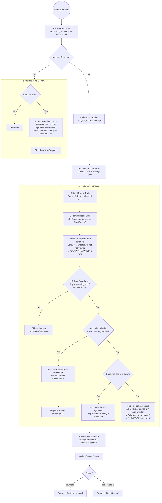
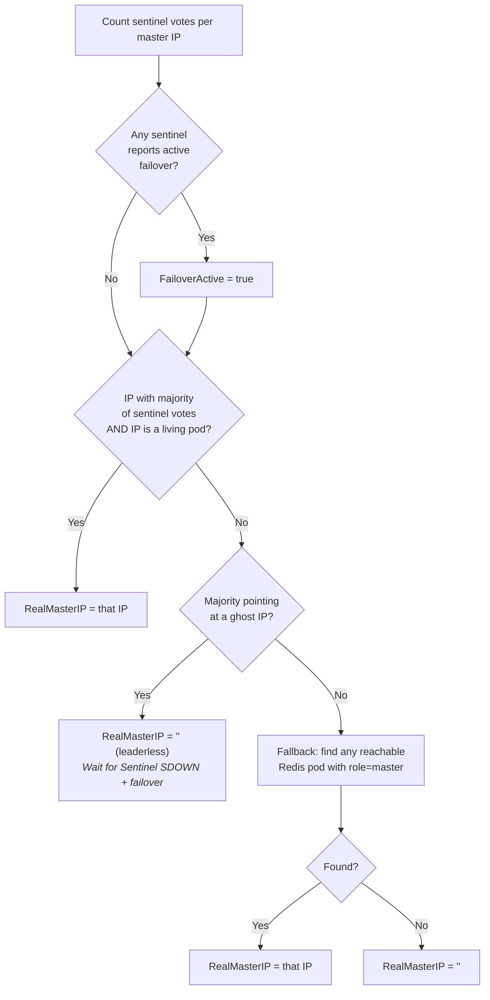
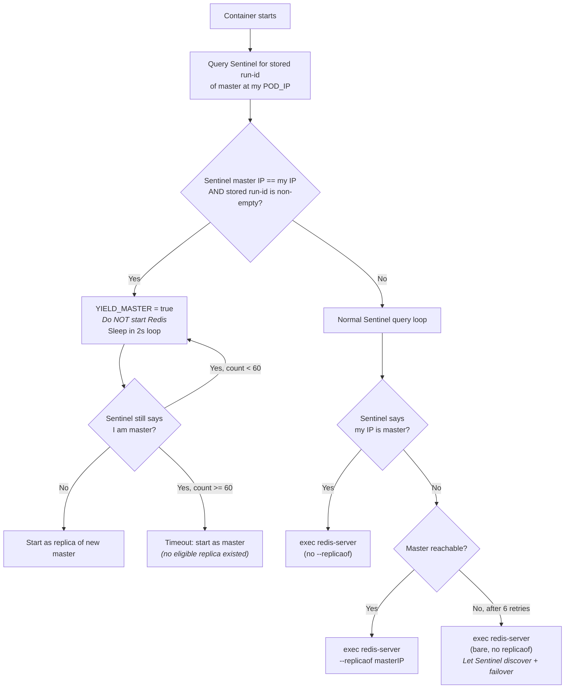

# Sentinel Mode Reconciliation Loop

This document describes the detailed reconciliation logic for **Sentinel mode** in the LittleRed operator.

For the high-level view that includes standalone and cluster modes, see [RECONCILIATION_LOOP.md](RECONCILIATION_LOOP.md).

---

## Overview

Sentinel mode manages three components:
- **Redis pods** (StatefulSet `<name>-redis`): one master + N-1 replicas
- **Sentinel pods** (StatefulSet `<name>-sentinel`): 3 sentinels forming a quorum
- **The operator**: observes ground truth, applies healing rules, stays passive during transitions

The operator follows a strict **enablement-over-intervention** philosophy (ADR-003): trust Sentinel's built-in failure detection (SDOWN/ODOWN) and failover mechanism. Only intervene when Sentinel cannot self-heal (ghost nodes, divergent masters, bare sentinels).

---

## Main Flow

---

## Ground Truth Gathering

The operator queries **every** Redis and Sentinel pod on each reconcile cycle to build a `SentinelClusterState`:

| Source | Data Collected |
|--------|---------------|
| Each Redis pod (`INFO replication`) | Role, MasterHost, LinkStatus, Offset, Reachable |
| Each Sentinel pod (`SENTINEL MASTER`, `SENTINEL REPLICAS`) | MasterIP, FailoverStatus, Monitoring, Reachable, Replica list |

### DetermineRealMaster Algorithm

The **ghost-majority guard** (LR-004) is critical: if most sentinels still point at a dead IP, it means Sentinel hasn't timed out yet. Falling back to Redis self-report would identify a restarted pod as master and trigger ghost pruning that resets Sentinel's SDOWN timers — blocking failover indefinitely.

---

## Healing Rules Detail

### Rule 0: Re-register Bare Sentinels

**Trigger**: Sentinel pod is reachable but `Monitoring == false` (no master configured).

**Cause**: A sentinel pod restarted with a new IP after bootstrapRequired was already cleared. Sentinel gossip cannot help here — without a MONITOR command, the pod doesn't know which pubsub channel to subscribe to.

**Action**: `SENTINEL MONITOR mymaster <RealMasterIP>` + apply all settings (auth-pass, down-after, failover-timeout, parallel-syncs) directly to that pod's IP.

**Safety**: Always safe — adding a monitor to an unconfigured sentinel is non-disruptive.

### Rule A: Guardrails

**Trigger**: Any pod has `DeletionTimestamp != nil` OR `FailoverActive == true`.

**Action**: Skip all healing rules. Return immediately.

**Rationale**: Kubernetes (pod termination) or Sentinel (failover election) is already performing a transition. Operator interference during transitions causes race conditions and timer resets.

### Ghost Master Correction (LR-005, LR-008)

**Trigger**: A sentinel is monitoring a master IP that is either:
- A ghost (IP not in current pod list), OR
- A living pod that is NOT the consensus RealMasterIP (divergent sentinel)

**Action**: `SENTINEL REMOVE mymaster` followed by `SENTINEL MONITOR mymaster <RealMasterIP>` + settings. This is a targeted fix on the individual sentinel pod, not a broadcast.

**Safety**: Only performed when `RealMasterIP != ""` AND `RealMasterIP` is living and reachable. If the cluster is leaderless, the operator stays passive.

**Why not RESET?** (LR-008): `SENTINEL RESET` does not change the monitored master IP. It only clears the replica list. A stuck sentinel pointing at a ghost IP stays stuck after RESET. `REMOVE + MONITOR` is the correct correction.

### Ghost Replica Pruning (Rule D)

**Trigger**: A sentinel's replica list contains IPs that are ghosts (not in K8s pod list) AND those replicas are in `s_down` state.

**Action**: `SENTINEL RESET mymaster` (broadcast to all sentinels via headless service).

**Safety**: Only issued when `RealMasterIP` is confirmed living and reachable. The `s_down` requirement prevents resetting during the brief window where a deleted pod's IP hasn't been marked down yet.

### Rule R: Replica Rescue (LR-009, LR-010)

**Trigger**: A reachable Redis pod that is NOT the RealMasterIP has:
- `Role == "master"` (thinks it's master, but consensus says otherwise), OR
- `MasterHost != RealMasterIP` (following the wrong master)

**Action**: `SLAVEOF <RealMasterIP> 6379`

**Safety**: Does NOT trigger on `LinkStatus == "down"` alone (LR-010). A transient link-down during handshake is normal and re-issuing SLAVEOF would interrupt it.

---

## Pod-Level Safety: Kill-9 / Crash Protection

The Redis startup script (in the container entrypoint) implements its own crash detection independent of the operator:

This mechanism is documented in [ADR-001 (amendment)](adr/001-strict-ip-identity.md#amendment-in-pod-process-crash--known-limitation-accepted).

---

## Pre-Stop Hook

The sentinel-mode Redis pre-stop hook ensures graceful shutdown:

1. Checks if this pod is the master via `redis-cli ROLE`
2. If master: triggers `SENTINEL FAILOVER mymaster` on a sentinel so a replica is promoted before this pod terminates
3. Waits for Sentinel to confirm a different master before allowing shutdown
4. If replica: simply shuts down (Sentinel will detect and update its replica list)

---

## Status Determination

The operator reports `Phase: Running` only when ALL of these are true:
- All Redis pods ready (StatefulSet)
- All Sentinel pods ready (StatefulSet)
- Sentinel reports a known master (`masterPodName != ""`)
- Sentinel knows N-1 replicas as healthy (no `s_down`, `o_down`, or `disconnected` flags)

This prevents premature "Running" status before Sentinel has fully discovered the topology — which would allow tests or users to trigger failover before all replicas are registered.

---

## References
- [ADR-001: Strict IP-Only Identity](adr/001-strict-ip-identity.md)
- [ADR-003: Low-Interference Sentinel Reconciliation](adr/003-low-interference-sentinel-reconciliation.md)
- [Reconciliation Algorithm Changelog](RECONCILIATION_ALGORITHM_CHANGELOG.md)
- [RECONCILIATION_LOOP.md](RECONCILIATION_LOOP.md) — high-level view
