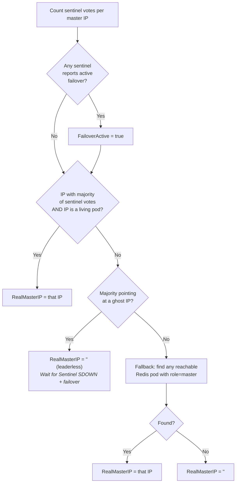
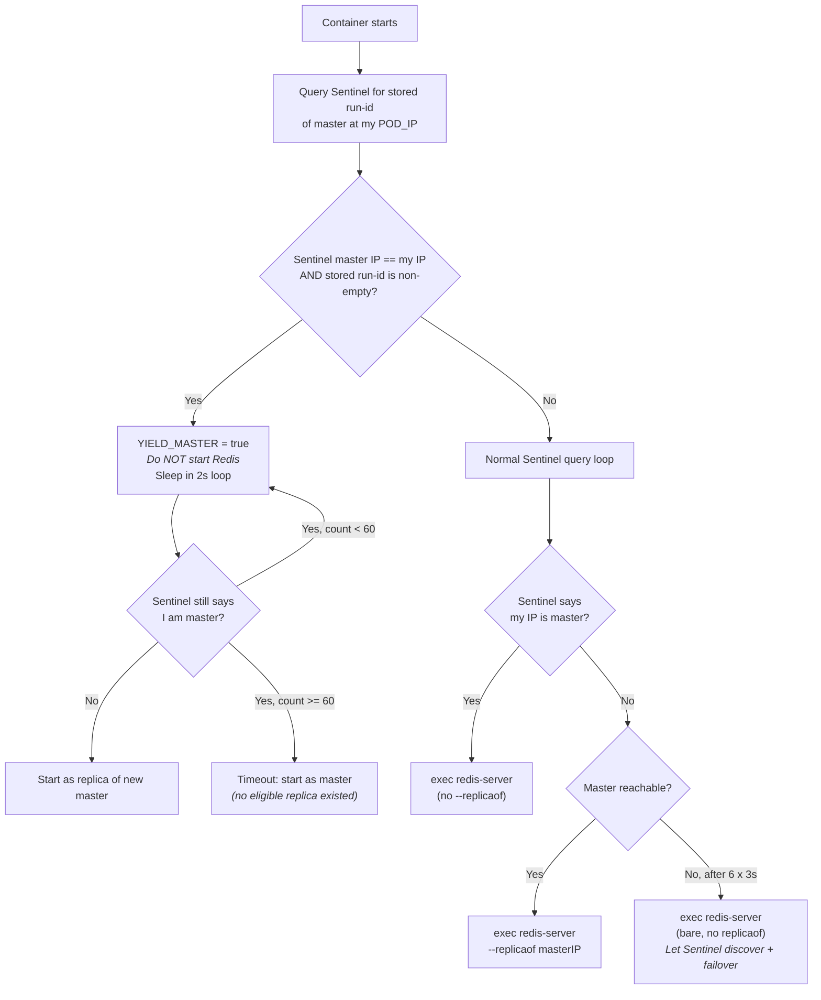

# Sentinel Mode Reconciliation Loop

This document describes the detailed reconciliation logic for **Sentinel mode** in the LittleRed operator.

For the high-level view that includes standalone and cluster modes, see [RECONCILIATION_LOOP.md](RECONCILIATION_LOOP.md).

---

## Overview

Sentinel mode manages three components:
- **Redis pods** (StatefulSet `<name>-redis`): one master + N-1 replicas
- **Sentinel pods** (StatefulSet `<name>-sentinel`): 3 sentinels forming a quorum
- **The operator**: observes ground truth, applies healing rules, stays passive during transitions

The operator follows a strict **enablement-over-intervention** philosophy (ADR-003): trust Sentinel's built-in failure detection (SDOWN/ODOWN) and failover mechanism. Only intervene when Sentinel cannot self-heal (ghost nodes, divergent masters, bare sentinels).

**Every Sentinel command below names the instance's own master** — `spec.sentinel.masterName`,
required and unique per pod network (ADR-015, LR-039). `<masterName>` in this document stands for
that value. It is not a formality: the master name is the only isolation Sentinel's gossip protocol
has, so two instances sharing one are a single deployment as far as Sentinel is concerned, and
either can reassign the other's master. Instances predating the field fall back to the historic
shared `mymaster` and carry a `SentinelMasterNameUnscoped` warning condition.

---

## Main Flow

```mermaid
graph TD
    Start((reconcileSentinel)) --> Resources["Ensure Resources<br/><i>Redis CM, Sentinel CM, SVCs, STSs</i>"]
    Resources --> BootstrapCheck{bootstrapRequired?}

    BootstrapCheck -- Yes --> BootstrapFlow
    BootstrapCheck -- No --> Labels

    subgraph BootstrapFlow ["Bootstrap (First Deploy)"]
        direction TB
        WaitIP{redis-0 has IP?}
        WaitIP -- No --> ReturnBoot[Requeue]
        WaitIP -- Yes --> ConfigEach["For each sentinel pod IP:<br/>SENTINEL MONITOR &lt;masterName&gt; &lt;redis-0-IP&gt;<br/>SENTINEL SET auth-pass, down-after, etc."]
        ConfigEach --> ClearFlag["Clear bootstrapRequired"]
    end

    Labels["updateMasterLabel<br/><i>Surgical pod role labeling</i>"]
    Labels --> Healing["reconcileSentinelCluster<br/><i>Ground Truth + Healing Rules</i>"]

    Healing --> HealingDetail
    HealingDetail --> Monitor["ensureSentinelMonitor<br/><i>Background +switch-master subscriber</i>"]
    Monitor --> Status["updateSentinelStatus"]
    Status --> PhaseCheck{Phase?}

    PhaseCheck -- Running --> SteadyRequeue["Requeue @ steady interval"]
    PhaseCheck -- Not Running --> FastRequeue["Requeue @ fast interval"]

    subgraph HealingDetail ["reconcileSentinelCluster"]
        direction TB
        Gather["Gather Ground Truth<br/><i>Query all Redis + Sentinel pods</i>"]
        Gather --> DetermineRM["DetermineRealMaster<br/><i>Sentinel majority vote → RealMasterIP</i>"]
        DetermineRM --> Rule0

        Rule0["Rule 0: Re-register bare sentinels<br/><i>Sentinel reachable but not monitoring</i><br/><i>→ SENTINEL MONITOR + SET</i>"]
        Rule0 --> RuleN

        RuleN["Rule N: Prune stale master names<br/><i>Any name monitored that is not the desired one</i><br/><i>→ SENTINEL REMOVE (gated)</i>"]
        RuleN --> RuleA

        RuleA{"Rule A: Guardrails<br/>Any terminating pods?<br/>Failover active?"}
        RuleA -- Yes --> SkipAll["Skip all healing<br/><i>Let Sentinel/K8s finish</i>"]
        RuleA -- No --> Leaderless

        Leaderless{"RealMasterIP == ''?<br/><i>no living consensus master</i>"}
        Leaderless -- Yes --> Deadlocks["Rule L (LR-015): all Sentinels BARE<br/>→ elect by data-holder count<br/><br/>Ghost-master recovery (LR-024):<br/>Sentinels pinned to a DEAD master,<br/>no promotable replica<br/>→ elect by replication lineage"]
        Deadlocks --> ReturnLeaderless["Return — every other rule<br/>needs a consensus master"]
        Leaderless -- No --> GhostMaster

        GhostMaster{"Sentinel monitoring<br/>ghost or wrong master?"}
        GhostMaster -- Yes --> Reregister["SENTINEL REMOVE + MONITOR<br/><i>Point to correct RealMasterIP</i>"]
        Reregister --> RequeueGhost["Requeue to verify convergence"]
        GhostMaster -- No --> GhostReplica

        GhostReplica{"Ghost replicas in s_down?"}
        GhostReplica -- Yes --> WholeCheck{"Cluster whole?<br/>all Redis pods reachable"}
        WholeCheck -- No --> SkipReset["Skip RESET, requeue<br/><i>Defer: RESET racing a node loss<br/>would strand failover (LR-013)</i>"]
        WholeCheck -- Yes --> ReplicaCheck{"≥1 healthy replica<br/>known to Sentinel?"}
        ReplicaCheck -- Yes --> Reset["SENTINEL RESET &lt;masterName&gt;<br/><i>Whole + master living/reachable + replicas known</i>"]
        ReplicaCheck -- No --> SkipReset
        GhostReplica -- No --> RuleR

        RuleR["Rule R: Replica Rescue<br/><i>Any non-master pod with role=master<br/>or following wrong master?<br/>→ SLAVEOF RealMasterIP</i>"]
    end
```

---

## Ground Truth Gathering

The operator queries **every** Redis and Sentinel pod on each reconcile cycle to build a
`ReplicationState`. The probes run **concurrently**, each under a hard `ProbeTimeout` (3 s)
deadline — sequential, unbounded probes let a single blackholing dead pod IP stall one reconcile
for ~146 s on a managed cloud, starving the recovery rules of the loop iterations they needed
(LR-017; the sentinel-mode completion of LR-012):

| Source | Data Collected |
|--------|---------------|
| Each Redis pod (`INFO replication`) | Role, MasterHost, LinkStatus, Offset, Reachable |
| Each Sentinel pod (`SENTINEL MASTER`, `SENTINEL REPLICAS`, `SENTINEL MASTERS`) | MasterIP, FailoverStatus, Monitoring, Reachable, Replica list, **MonitoredMasters** (every name that Sentinel carries, with its address and flags — LR-048) |

`SENTINEL MASTERS` is one extra bounded round trip per Sentinel per pass, paid **unconditionally**
rather than only when a Sentinel reads bare: a Sentinel carrying *both* a leftover name and the
desired one answers `Monitoring: true`, so a bareness-triggered probe would never see the two-name
state — which is exactly the state a half-finished rename leaves behind. A failed read degrades to
an **empty list**, never to `Reachable: false` (LR-041), so emptiness is not evidence of absence.

### DetermineRealMaster Algorithm

```mermaid
graph TD
    Start["Count sentinel votes per master IP"] --> Failover{Any sentinel<br/>reports active<br/>failover?}
    Failover -- Yes --> SetFlag["FailoverActive = true"]
    Failover -- No --> Majority

    SetFlag --> Majority

    Majority{"IP with majority<br/>of sentinel votes<br/>AND IP is a living pod?"}
    Majority -- Yes --> Accept["RealMasterIP = that IP"]
    Majority -- No --> GhostCheck

    GhostCheck{"Majority pointing<br/>at a ghost IP?"}
    GhostCheck -- Yes --> NoMaster["RealMasterIP = '' (leaderless)<br/><i>Wait for Sentinel SDOWN + failover</i>"]
    GhostCheck -- No --> RedisFallback

    RedisFallback["Fallback: find any reachable<br/>Redis pod with role=master"]
    RedisFallback --> FoundRedis{Found?}
    FoundRedis -- Yes --> AcceptRedis["RealMasterIP = that IP"]
    FoundRedis -- No --> NoMasterRedis["RealMasterIP = ''"]
```

The **ghost-majority guard** (LR-004) is critical: if most sentinels still point at a dead IP, it means Sentinel hasn't timed out yet. Falling back to Redis self-report would identify a restarted pod as master and trigger ghost pruning that resets Sentinel's SDOWN timers — blocking failover indefinitely.

---

## Healing Rules Detail

### Rule 0: Re-register Bare Sentinels

**Trigger**: Sentinel pod is reachable but `Monitoring == false` (no master configured).

**Cause**: A sentinel pod restarted with a new IP after bootstrapRequired was already cleared. Sentinel gossip cannot help here — without a MONITOR command, the pod doesn't know which pubsub channel to subscribe to.

**Action**: `SENTINEL MONITOR <masterName> <RealMasterIP>` + apply all settings (auth-pass, down-after, failover-timeout, parallel-syncs) directly to that pod's IP.

**Safety**: Always safe — adding a monitor to an unconfigured sentinel is non-disruptive.

### Rule N: Stale Master-Name Pruning (LR-048, ADR-018)

**Trigger**: a reachable Sentinel monitors any master name other than `spec.sentinel.masterName`.

**Cause**: Sentinel persists every `sentinel monitor <name> …` it is given, and nothing used to take
one away. Editing `masterName` registered the new name (via Rule 0, which sees the quorum read bare
for a name it does not know) and left the old one in place **forever** — one master under two names,
two config epochs, two independent failover state machines over the same three pods. The master's
baked stale-name preStop then fired a real `SENTINEL failover <old>` into it. This is LR-039's named
hazard, reached from a supported field edit on a healthy instance.

**Action**: `SENTINEL REMOVE <staleName>` per Sentinel, per stale name, decided by the pure
`planStaleMasterNames`. Nothing is remembered — no previous name, no phase, no cursor: anything
monitored that is not the desired name is stale by definition, which is also why this repairs an
instance a *previous* botched rename (or a hand-issued `MONITOR`) already broke.

**Position: after Rule 0, and deliberately BEFORE Rule A.**

- *After Rule 0*, so the desired name is already registered on a bare Sentinel **in the same pass**.
  That is what makes the two-name window intra-pass rather than multi-pass, and what makes the
  prune's own precondition (G6) pass on the first attempt. A Sentinel is never left bare on purpose.
- *Before Rule A*, i.e. it runs while `anyTerminating` is true. This is the opposite of the LR-040
  defect and is chosen, not inherited: a rename rewrites the Redis pod template, so a pod is
  terminating from the moment of the edit, and **the churn Rule A sits out is exactly when a rename
  is in flight**. Gating on `!anyTerminating` would hold the two-name window open for the whole
  multi-minute roll — the one window in which `redis-0`'s stale-name preStop fires a real failover
  under the old name (measured: 56.6s of two names naming two different live pods as master).
- *LR-040's actual lesson therefore applies in full*: an action that runs during churn **must be
  bounded**. Every call Rule N makes (`Masters`, `IsMonitoring`, `Remove`) goes through
  `newBoundedClient` — all three of `Dial`/`Read`/`WriteTimeout` at `ProbeTimeout` — **and** carries
  a per-call context deadline. A context alone is inert against go-redis (LR-040's 5.02s → 5.00s).

**Gates** — `REMOVE` is destructive and this predicate is the only thing aiming it, so nearly all of
the value is in the refusals. Every one must hold:

| # | Gate | Which incident |
|---|---|---|
| G0 | A capture is **in evidence** (`planForsaken`'s `Captured`, computed once per pass and passed in) stands the whole rule down: reason `Foreign`, prune nothing | fed `Captured` and not `Forsaken`, because a *settled* `Forsaken` returns from the switch long before this line — `Forsaken` would be a structurally dead gate |
| G1 | `desired != ""` | LR-041: with an empty desired name **every** name reads as stale, so the failure mode is "prune everything" |
| G2 | a living, reachable master of **ours** — `RealMasterIP` set, in `ValidIPs`, and its own Redis view reporting a reachable master | LR-008's gate reused; pruning without it manufactures LR-015's leaderless deadlock. All three clauses: `RealMasterIP != ""` alone is not the gate |
| G3 | no monitored master, **under any name**, reports an in-flight failover | a failover under the stale name is still a real state machine reconfiguring our pods |
| G4 | reachable Sentinels ≥ quorum | do not operate on a minority |
| G5 | every stale entry's address is one of our pods **or** is flagged down; else `Foreign` — **unless our own Redis StatefulSet is mid-rollout, in which case `Deferred`** | the capture trap. Byte-identical to `planForsaken` clause 3 (and to `lrctl`'s copy, pinned by a parity test). The rollout clause is LR-050 |
| G6 | per Sentinel, the desired name is present on **that** Sentinel; else skip it and **name it in the condition message** | LR-024's `electMaster` shape. The caller re-confirms with a bounded `IsMonitoring` immediately before each `REMOVE`, because the plan's view is a gather already milliseconds old |

Deliberately **not** gates: `!anyTerminating` (above) and `Phase == Running` (the phase is written at
the tail of the pass and lags by one — LR-044's M4b finding; gate on the state, not on the phase).
G5 is evaluated *before* G2/G3/G4 although it is numbered after them: the capture trap fails G2 too,
so numeric order would report the generic *"no living master of ours"* and never the `Foreign`
diagnosis, in precisely the case the diagnosis exists for. Both prune nothing; only the sentence
changes.

**What Rule N must NOT do** (LR-007/LR-008/LR-013/LR-024): no `SENTINEL RESET` — it does not remove a
master entry and wiping the replica list is the known hazard; and no `REMOVE` of the **desired**
name — re-pointing that at a different address is LR-005/LR-008's job and stays there.

**Reported** on the `StaleMasterName` condition (`Converged` / `Pruning` / `Deferred` / `Foreign`;
`True` is bad), written only when something changed, one event per transition, a `Warning` only for
`Foreign`. The condition is mirrored onto the in-memory object after a successful update, because
`updateSentinelStatus` runs later in the same pass and would otherwise revert it (LR-044's bug).

**Not gated on `sn.Monitoring`, and that is load-bearing**: at pass 1 of a rename every Sentinel
reads `Monitoring:false, Reachable:true` — the single-name probe asks about the *new* name — while
still carrying the old entry. Gating on `Monitoring` would make Rule N inert on exactly the pass it
must act.

### Rule A: Guardrails

**Trigger**: Any pod has `DeletionTimestamp != nil` OR `FailoverActive == true`.

**Action**: Skip all healing rules. Return immediately.

**Rationale**: Kubernetes (pod termination) or Sentinel (failover election) is already performing a transition. Operator interference during transitions causes race conditions and timer resets.

### Ghost Master Correction (LR-005, LR-008)

**Trigger**: A sentinel is monitoring a master IP that is either:
- A ghost (IP not in current pod list), OR
- A living pod that is NOT the consensus RealMasterIP (divergent sentinel)

**Action**: `SENTINEL REMOVE <masterName>` followed by `SENTINEL MONITOR <masterName> <RealMasterIP>` + settings. This is a targeted fix on the individual sentinel pod, not a broadcast.

**Safety**: Only performed when `RealMasterIP != ""` AND `RealMasterIP` is living and reachable. If the cluster is leaderless, the operator stays passive.

**Why not RESET?** (LR-008): `SENTINEL RESET` does not change the monitored master IP. It only clears the replica list. A stuck sentinel pointing at a ghost IP stays stuck after RESET. `REMOVE + MONITOR` is the correct correction.

### Ghost Replica Pruning (Rule D)

**Trigger**: A sentinel's replica list contains IPs that are ghosts (not in K8s pod list) AND those replicas are in `s_down` state.

**Action**: `SENTINEL RESET <masterName>` (broadcast to all sentinels via headless service).

**Safety** (LR-001, LR-007, LR-008, LR-011, LR-013): RESET is only issued when ALL of these hold (encoded in the pure predicate `ReplicationState.GhostReplicaResetSafe`):
1. The cluster is **whole** — every expected Redis pod (`SentinelRedisReplicas` = 3) is reachable
2. `RealMasterIP` is confirmed living and reachable
3. At least 1 healthy (non-ghost, non-`s_down`) replica is known to Sentinel

Conditions 2–3 (LR-011) prevent a race after failover: RESET wipes Sentinel's entire replica list. If issued before Sentinel re-discovers the surviving replicas (which takes a few seconds after `+switch-master`), the next failover attempt fails with `-failover-abort-no-good-slave`.

Condition 1 (LR-013) closes the gap that 2–3 missed: a **force-deleted master** (`--grace-period=0`) *vanishes* rather than *terminates*, so the snapshot can still show it reachable with healthy replicas while the cluster is actually down a node. Issuing RESET then strands every sentinel with an `o_down` master and an empty, un-rebuildable replica list (replicas are only learned via the master's `INFO`) — a permanent deadlock. The wholeness check is K8s-grounded and computed from ground truth already gathered each loop, so it costs no extra requests. Deferring the RESET while not whole is always safe: the ghost entry is harmless and is pruned once the cluster is whole again. The operator logs a skip and retries on the next reconcile cycle.

### Rule L: Leaderless Bootstrap-Deadlock Recovery (LR-015, ADR-005)

**Trigger**: `RealMasterIP == ""` AND **all** reachable Sentinels are *bare* (reachable, monitoring
nothing) AND a reachable Sentinel quorum exists AND Rule A passes AND the state has persisted past
a 30 s cooldown (`status.leaderlessSince`).

**Cause**: `bootstrapRequired` is set once, at `Phase == ""`, and never re-armed. A mass pod restart
of an already-initialized instance therefore leaves every Sentinel with no master and no path back:
`RealMasterIP == ""`, so every consensus-master-gated rule above short-circuits, and the Redis pods
sit in the startup wait-loop asking Sentinel for a master that nobody will assign.

**Action**, decided by the pure `planLeaderlessRecovery` and keyed on how many reachable pods hold
keys (`RedisNodeState.Keys`, from the full `INFO`):

| Data holders | Decision |
|---|---|
| 0 | Seed `redis-0` as master — nothing to lose |
| exactly 1 | Promote that pod (`REPLICAOF NO ONE`) — it is a lone survivor; nothing else holds data |
| ≥ 2 | **Refuse** and wait for a human, unless `sentinel.allowUnsafeRebootstrapOnDeadlock` — electing one discards the others |

**Safety**: the all-bare requirement is what distinguishes a bootstrap deadlock from a *recent
master death*, where Sentinels still monitor the dead master and can fail over on their own. The
30 s cooldown gives Sentinel its full down-after + election window first.

**Related probe rule** (LR-016): the sentinel Redis **liveness** probe is a plain local health check
(bootstrap guard + local `PING`) and must never restart a replica because its master is unreachable.
During a leaderless deadlock that would wipe the very survivor data this rule exists to preserve —
storage is EmptyDir. A masterless replica is healthy-and-waiting; the **readiness** probe still
requires `link:up`, so it is pulled from traffic without being killed.

### Ghost-Master Deadlock Recovery (LR-024)

**Trigger**: `RealMasterIP == ""` AND a majority of reachable Sentinels monitor a **ghost** master
(a dead IP) AND **no** healthy replica is known to Sentinel AND a reachable quorum exists AND a 30 s
cooldown (`status.ghostMasterStuckSince`) has elapsed.

**Cause**: the gap between the two rules above it. A graceful failover leaves the old master as a
ghost replica; Rule D's `SENTINEL RESET` then legitimately fires (the cluster is whole between the
two failovers) and empties Sentinel's replica list; a second, crash failover then finds
`-failover-abort-no-good-slave` forever. LR-008 correction cannot act (it needs a *living* consensus
master) and Rule L cannot act (the Sentinels are not bare). Source-confirmed in Redis and Valkey
`sentinel.c`: no surgical single-replica prune exists and a dead replica never ages out, so this
deadlock is only reachable via — and only recoverable after — a whole-list RESET.

**Action**: elect the most-complete survivor (`BestDataHolder`) via `REPLICAOF NO ONE`, then
re-`MONITOR`.

**Safety gate is replication LINEAGE, not holder count** — the deliberate contrast with Rule L.
`holdersDiverged` runs union-find over both `master_replid` *and* `master_replid2`, so a normal
post-failover **promotion chain** (a promoted node rotates `master_replid`, the old value moving to
`master_replid2`) reads as one lineage and elects with no opt-in. Only genuinely independent
lineages require `allowUnsafeRebootstrapOnDeadlock`. Keying lineage on `master_replid` alone made a
first e2e run refuse a perfectly ordinary chain.

### Rule R: Replica Rescue (LR-009, LR-010)

**Trigger**: A reachable Redis pod that is NOT the RealMasterIP has:
- `Role == "master"` (thinks it's master, but consensus says otherwise), OR
- `MasterHost != RealMasterIP` (following the wrong master)

**Action**: `SLAVEOF <RealMasterIP> 6379`

**Safety**: Does NOT trigger on `LinkStatus == "down"` alone (LR-010). A transient link-down during handshake is normal and re-issuing SLAVEOF would interrupt it.

---

### Forsaken Verdict and Quarantine (LR-042, LR-044, ADR-016)

The one **terminal** verdict in sentinel mode, and the only path that stops the healing chain
rather than adding to it. It applies to an instance **captured** by another Sentinel deployment
sharing its master name (ADR-015, LR-039), which is unrecoverable by design.

**Verdict** (`planForsaken`, pure). All four clauses must hold, plus a 30s `forsakenCooldown`
tracked in `status.forsakenSince`. They range over **every** `(address, flags)` a reachable Sentinel
monitors under **any** name, not only the desired one (LR-048): a capture under a *stale* name is
still a capture, and scoping the verdict to the desired name made it evaporate the moment an owner
renamed a captured instance — taking the quarantine with it:
1. At least one reachable, **monitoring** Sentinel (bare Sentinels are Rule L's business).
2. Every reachable monitoring Sentinel agrees on ONE master address (disagreement is a
   transition, and transitions are not verdicts).
3. That address is not one of our pods **and is not flagged down** (the down flag keeps ordinary
   post-failover debris — LR-024's dead ghost — out of this).
4. No reachable Redis pod of ours is a master (while one is, the existing rules own it).

Conservative in one direction on purpose: a false positive parks a live instance, a false negative
merely leaves the previous behaviour.

**Plus one input that is not a clause (LR-050): while our own Redis StatefulSet is not settled, the
operator does not ATTRIBUTE addresses at all** — neither here nor at Rule N's G5. A pod of ours that
has just been replaced has left `ValidIPs` and has not yet reached `s_down`, which is byte-identical
to a captor's live master; an ordinary rename presented the whole signature for a measured 42.5s
against the 30s cooldown and quarantined a healthy instance. The predicate is LR-021's
`statefulSetRolloutSettled`, read **uncached**, passed into both planners in-signature. **The gate
suppresses ARMING and nothing else**: a rollout cannot *start* a verdict, and it never *clears* one
either — the ordinary clauses still clear on ordinary evidence, which is what the quarantine's
self-clearing lifecycle depends on.

**Effect of the verdict**: the operator returns **before Rule 0**, so no rule fights a battle
ADR-015 §9.2 proved unwinnable; it logs once per transition; and it requeues at the **steady**
interval (`requeueAfterNotRunning`, shared by `updateStatus` and `updateSentinelStatus` — LR-045
found the switch was inert for sentinel mode, the only mode that can be forsaken). The instance
stays `Ready=False`. The verdict is retracted automatically once the signature clears.

**Quarantine** (`planQuarantine`, pure — gated on the verdict): desired Redis **and** Sentinel
replicas are 0 while it is armed, so the **captor** heals through Rule D above (its gates all pass
once the departed pods are merely `s_down` ghosts judged against the captor's own expected count);
after a 120s settle the pods return with all Sentinels bare and zero data holders, which is Rule L's
no-data reseed signature. Bounded to 2 attempts (1 when auth is off **and** the effective master
name is the legacy `mymaster`), then latched at zero.

Two refusals of its own (`quarantineDataRisk`), because this planner deletes pods:
- `HoldDataPresent` — a reachable pod holds keys **not** explained by the capture. Keys on a
  link-`up` replica of the captor's master are the captor's own dataset, still present on the
  captor; keys anywhere else may be the only copy.
- `HoldDataUnknown` — a pod could not be *proven* empty: unreachable to the operator while the
  kubelet still reports its redis container Ready (LR-023's blackhole-proof signal, not LR-017's
  dial).

**Ordering constraint**: zero must be the **desired** replica count at build time, not a
scale-down. Both StatefulSets are server-side-applied with `ForceOwnership` *before* the verdict is
computed, so the *armed* quarantine is decided pre-gather from `status.quarantinedSince` alone
(`sentinelDesiredReplicas`); arming stays after the gather. Otherwise the applies force the pods
back every pass and they rejoin the captor's quorum in between.

`status.quarantinedSince` and `status.quarantineAttempts` hold the state, because the verdict
provably self-clears while quarantined (no pods ⇒ no reachable monitoring Sentinel ⇒ clause 1
fails). The counter clears only on `Phase == Running`; clearing the two fields is also the manual
release for a latched instance.

---

## Pod-Level Safety: Kill-9 / Crash Protection

The Redis startup script (in the container entrypoint) implements its own crash detection independent of the operator:

```mermaid
graph TD
    Start["Container starts"] --> QuerySentinel["Query Sentinel for stored run-id<br/>of master at my POD_IP"]
    QuerySentinel --> CrashCheck{"Sentinel master IP == my IP<br/>AND stored run-id is non-empty?"}

    CrashCheck -- Yes --> Yield["YIELD_MASTER = true<br/><i>Do NOT start Redis</i><br/>Sleep in 2s loop"]
    CrashCheck -- No --> NormalBoot["Normal Sentinel query loop"]

    Yield --> YieldLoop{"Sentinel still says<br/>I am master?"}
    YieldLoop -- Yes, count < 60 --> Yield
    YieldLoop -- No --> JoinAsReplica["Start as replica of new master"]
    YieldLoop -- Yes, count >= 60 --> Timeout["Timeout: start as master<br/><i>(no eligible replica existed)</i>"]

    NormalBoot --> AmIMaster{"Sentinel says<br/>my IP is master?"}
    AmIMaster -- Yes --> StartMaster["exec redis-server<br/>(no --replicaof)"]
    AmIMaster -- No --> PingMaster{"Master reachable?"}
    PingMaster -- Yes --> StartReplica["exec redis-server<br/>--replicaof masterIP"]
    PingMaster -- No, after 6 x 3s --> StartBare["exec redis-server<br/>(bare, no replicaof)<br/><i>Let Sentinel discover + failover</i>"]
```

This mechanism is documented in [ADR-001 (amendment)](adr/001-strict-ip-identity.md#amendment-in-pod-process-crash--known-limitation-accepted).

**On the master PING** (`PING_ATTEMPTS=6`, `PING_DELAY=3`): ADR-002 removed the *blocking* variant,
where a replica would wait indefinitely for an unreachable master and so never register with
Sentinel — no replicas, therefore no failover candidate, therefore a deadlock. The check itself
remains, but bounded: after ~18 s it gives up and starts **bare**, so Sentinel discovers a live
replica either way. That avoids both the ADR-002 deadlock and the zombie-replica problem.

---

## Pre-Stop Hook

The sentinel-mode Redis pre-stop hook ensures graceful shutdown:

1. Checks if this pod is the master via `redis-cli INFO replication`
2. If master:
   a. Waits (up to 10s) for Sentinel to know at least 2 replicas — prevents triggering failover before Sentinel has candidates to promote
   b. Pauses writes for 30s via `CLIENT PAUSE`
   c. Triggers `SENTINEL FAILOVER <masterName>` on a sentinel
   d. Waits (up to 10s) for Sentinel to confirm a different master
3. If replica: simply shuts down (Sentinel will detect and update its replica list)

**The name in the hook is baked into the container spec**, so during a master-name rename the pod
being replaced still carries the *old* one. Once Rule N has pruned that entry, its
`SENTINEL FAILOVER <old>` fails with `ERR No such master with that name` and there is no proactive
handover: the new name's quorum waits out `down-after-milliseconds` (30s by default) before
electing. Expected, documented, and harmless with writes quiesced — a rename is a maintenance
window. Closing it for good means taking the name out of the pod spec altogether (a mounted file
re-read at start and stop), which is deferred: ADR-018 Alternative D.

---

## Status Determination

The operator reports `Phase: Running` only when ALL of these are true:
- All Redis pods ready (StatefulSet)
- All Sentinel pods ready (StatefulSet)
- Sentinel reports a known master (`masterPodName != ""`)
- Sentinel knows N-1 replicas as healthy (no `s_down`, `o_down`, or `disconnected` flags)

This prevents premature "Running" status before Sentinel has fully discovered the topology — which would allow tests or users to trigger failover before all replicas are registered.

---

## References
- [ADR-001: Strict IP-Only Identity](adr/001-strict-ip-identity.md)
- [ADR-002: Remove the blocking startup PING](adr/002-remove-startup-ping-check.md)
- [ADR-003: Low-Interference Sentinel Reconciliation](adr/003-low-interference-sentinel-reconciliation.md)
- [ADR-005: Leaderless Bootstrap-Deadlock Recovery](adr/005-leaderless-bootstrap-recovery.md)
- [ADR-015: Per-Instance Sentinel Master Name](adr/015-per-instance-sentinel-master-name.md)
- [ADR-016: Forsaken-Gated Quarantine](adr/016-forsaken-gated-quarantine.md)
- [ADR-018: In-Place Sentinel Master-Name Rename](adr/018-sentinel-master-name-rename.md) — Rule N
- [Reconciliation Algorithm Changelog](RECONCILIATION_ALGORITHM_CHANGELOG.md)
- [RECONCILIATION_LOOP.md](RECONCILIATION_LOOP.md) — high-level view
